# kbexplorer — a unifying overlay network

kbexplorer is a **unifying overlay** that sits on top of many **systems of record**,
turns them into one continuously-evolving knowledge graph, and projects that graph
as many **representations** for many kinds of consumers.

The diagram reads in three bands (bottom → top = data flow):

- **Systems of record (bottom):** the sources kbexplorer ingests — web/APIs, cloud
  stores, databases, servers, reports, files, git repos, GitHub.
- **The overlay (middle):** kbexplorer unifies those sources into a single knowledge
  graph with stable `kg://` identity, via
  `sources → providers → engine → representation`. The graph animates as a build-up
  from a seed to convey that it evolves continuously over time.
- **Consumers / representations (top):** the many ways the graph is projected —
  individuals, teams, agents & Copilot, community, dashboards, apps & sites,
  smart spaces.

Each layer depends only on the contracts in
[`@anokye-labs/kbexplorer-core`](https://github.com/anokye-labs/kbexplorer-core),
so any one layer can be swapped without touching the others. For the full treatment
see [`docs/architecture.md`](../../docs/architecture.md).

> The diagram is a hand-authored SVG (`overlay-network.svg`) with a CSS-animated
> build-up; motion respects `prefers-reduced-motion`.
