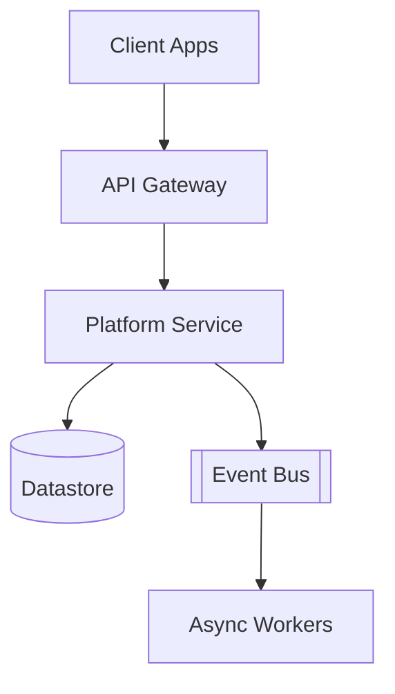

# Platform

The **Platform** is the shared backbone the rest of the organization builds on —
the services, gateways, and data stores that product teams depend on rather than
re-implement. This page is a live demonstration of kbexplorer's **rich-Markdown**
slice: the facts in the frontmatter above render as a structured panel, the prose
renders as a reading view, and the embedded diagram below is rendered live from
this document's source.

## Shape of the system

The gateway fronts every request; the Platform Service owns the core domain and
persists to the datastore; long-running work is handed to async workers over the
event bus.

## How this renders

This document opts into rich-Markdown rendering with `display: rich-markdown` in
its frontmatter. At build time kbexplorer's rich-Markdown **provider** ingests it
into a graph node — lifting the frontmatter into structured facts, extracting the
fenced diagram as an embedded block, and resolving typed links to edges. The SPA's
rich-Markdown **representation** then composes those parts into the view you are
reading. One document; many faithful views over the same pure graph.
