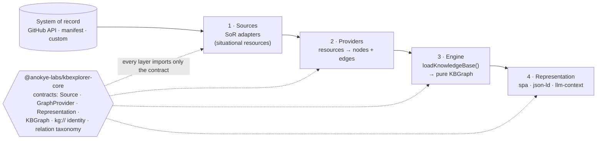
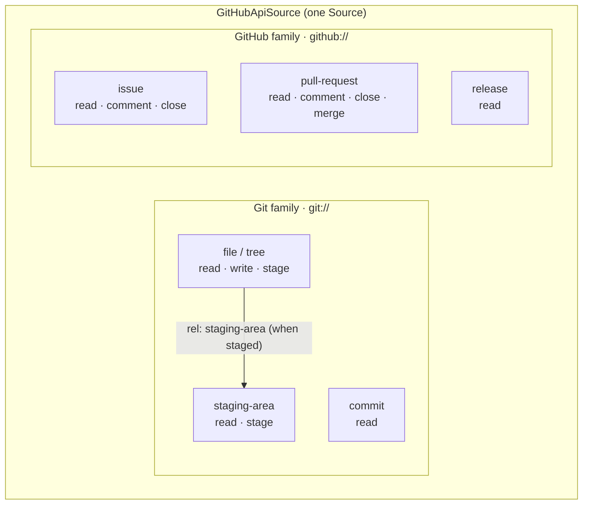
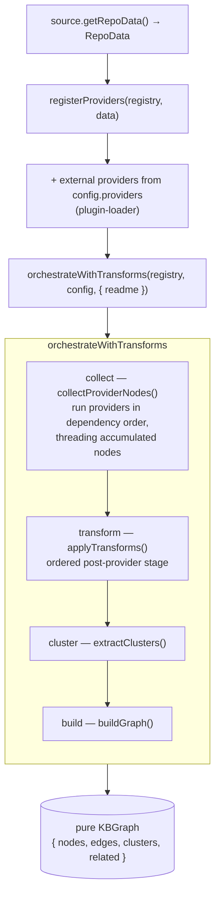
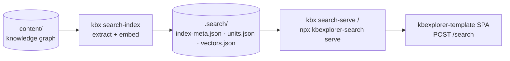

# kbexplorer architecture

kbexplorer turns a system of record (a GitHub repository, a static manifest, a
third-party service) into a **pure knowledge graph** and then renders that graph
for many targets — an interactive website, deterministic linked data, or a
token-budgeted context pack for an LLM.

It is organized as **four decoupled layers**. Data flows left to right; every
layer depends only on the shared **contracts** in
[`@anokye-labs/kbexplorer-core`](https://github.com/anokye-labs/kbexplorer-core),
never on a concrete implementation of its neighbour. Swap any one layer for a
custom implementation of the same contract and the others are unaffected.



> This document is the full architecture treatment. For the canonical,
> file-by-file data-flow map of the reference implementation, see
> [`kbexplorer-template/docs/SUBSYSTEMS.md`](https://github.com/anokye-labs/kbexplorer-template/blob/main/docs/SUBSYSTEMS.md).
> Where this doc describes a *type*, it links to the canonical contract in
> `kbexplorer-core` rather than restating it — the contract is the source of
> truth.

## Contents

- [The one-way dependency rule](#the-one-way-dependency-rule)
- [The shared contract — `kbexplorer-core`](#the-shared-contract--kbexplorer-core)
- [Layer 1 — Sources](#layer-1--sources)
  - [§4A The source / affordance model](#4a-the-source--affordance-model)
- [Layer 2 — Providers](#layer-2--providers)
- [Layer 3 — Engine](#layer-3--engine)
- [Layer 4 — Representation](#layer-4--representation)
- [Search — a first-class representation over the graph](#search--a-first-class-representation-over-the-graph)
- [Cross-cutting — identity & relations](#cross-cutting--identity--relations)
- [The do-seam — affordances as a protocol-neutral action layer](#the-do-seam--affordances-as-a-protocol-neutral-action-layer)
- [Extension points](#extension-points)
- [Where things live](#where-things-live)

> **See also — the kbx story:** [personas](personas.md) ·
> [journeys](journeys.md) · [user-story demand map](user-stories.md) ·
> [roadmap & program](roadmap.md). This document covers *how kbx is built*; those cover
> *who it is for and what gets built next*.
>
> **See also — the surfaces, history, and open questions:**
> [the two surfaces](surfaces.md) covers the SPA showcase vs the embeddable
> Copilot canvas in depth; [history](history.md) is a verified, chronological
> account of how kbx got here; [decisions](decisions/) records design choices
> (made and still-open) worth preserving.

## The one-way dependency rule

The single invariant that makes the system decoupled:

> **Every layer depends on the contracts package and on nothing downstream or
> upstream of itself.** A Provider never imports a Source implementation; the
> Engine never imports a Representation; a Representation never imports the
> Engine. They meet only through the pure data types and interface *seams*
> published by `kbexplorer-core`.

This is enforced, not merely documented. In the reference implementation the
pure data types
([`src/types/__tests__/no-engine-import.test.ts`](https://github.com/anokye-labs/kbexplorer-template/blob/main/src/types/__tests__/no-engine-import.test.ts))
import nothing from the engine at load, and the pure representation targets are
statically checked to contain **zero** import specifiers that resolve into the
engine — see
[`no-engine-import.test.ts`](https://github.com/anokye-labs/kbexplorer-template/blob/main/src/representation/targets/__tests__/no-engine-import.test.ts).

## The shared contract — `kbexplorer-core`

[`@anokye-labs/kbexplorer-core`](https://github.com/anokye-labs/kbexplorer-core)
is intentionally dependency-free and side-effect-free. It holds the pure data
types and the interface seams that every layer — and every third-party
extension — shares, so the contract lives in exactly one place.

| Concern | Contract | Source of truth |
|---|---|---|
| Pure graph data | `KBGraph` · `KBNode` · `KBEdge` · `Cluster` · `Connection` | [`src/graph.ts`](https://github.com/anokye-labs/kbexplorer-core/blob/main/src/graph.ts) |
| Source seam | `Source` · `Resource` · `Affordance` · `ResourceLink` · `STAGING_AREA_REL` | [`src/source.ts`](https://github.com/anokye-labs/kbexplorer-core/blob/main/src/source.ts) |
| Provider seam | `GraphProvider` · `defineProvider()` · `ProviderModule` · `checkProviderCompatibility()` | [`src/provider.ts`](https://github.com/anokye-labs/kbexplorer-core/blob/main/src/provider.ts) |
| Representation seam | `Representation` · `RepresentationTarget` · `RepresentationOptions` | [`src/representation.ts`](https://github.com/anokye-labs/kbexplorer-core/blob/main/src/representation.ts) |
| Identity | `kg://` URN helpers — `buildId` · `buildEdgeId` · `slugify` | [`src/identity.ts`](https://github.com/anokye-labs/kbexplorer-core/blob/main/src/identity.ts) |
| Relations | the six-member taxonomy — `mapRelation` · `KNOWN_RELATIONS` | [`src/relations.ts`](https://github.com/anokye-labs/kbexplorer-core/blob/main/src/relations.ts) |
| JSON-LD | `buildJsonLd()` envelope helper | [`src/jsonld.ts`](https://github.com/anokye-labs/kbexplorer-core/blob/main/src/jsonld.ts) |
| Config | `KBConfig` · `ExternalProviderConfig` | [`src/config.ts`](https://github.com/anokye-labs/kbexplorer-core/blob/main/src/config.ts) |

Everything is re-exported from
[`src/index.ts`](https://github.com/anokye-labs/kbexplorer-core/blob/main/src/index.ts).

---

## Layer 1 — Sources

A **Source** adapts a system of record (SoR) into retrievable, self-describing
**resources**. The contract is small and web/REST-inspired
([`Source`](https://github.com/anokye-labs/kbexplorer-core/blob/main/src/source.ts)):
`retrieve(query)` returns `Resource[]`, and an optional `get(href)` re-retrieves
a single resource by locator.

The reference implementation defines two sources behind one engine-facing
adapter, `RepoSource`
([`repo-data.ts`](https://github.com/anokye-labs/kbexplorer-template/blob/main/src/engine/sources/repo-data.ts)),
which both implements the pure `Source` contract **and** exposes
`getRepoData(): Promise<RepoData>` — the normalized bundle the engine consumes:

| Source | Backed by | Affordance posture |
|---|---|---|
| [`ManifestSource`](https://github.com/anokye-labs/kbexplorer-template/blob/main/src/engine/sources/manifest-source.ts) | a pre-built `repo-manifest.json` snapshot | every resource `['read']` only — a frozen snapshot has no staging area |
| [`GitHubApiSource`](https://github.com/anokye-labs/kbexplorer-template/blob/main/src/engine/sources/github-api-source.ts) | the live GitHub API | composite **Git ≠ GitHub** families; **per-retrieval** affordances |

### §4A The source / affordance model

This is the deliberate, load-bearing design decision of the Source layer. Read
it carefully — it is what lets one graph engine talk to read-only snapshots and
fully writable worktrees through the *same* interface.

#### Resources are self-describing and navigable

A [`Resource`](https://github.com/anokye-labs/kbexplorer-core/blob/main/src/source.ts)
carries everything a consumer needs without a second round-trip:

```ts
interface Resource<T = unknown> {
  href: string;            // stable locator for re-retrieval
  kind: string;            // open: 'file' | 'tree' | 'commit' | 'issue' | …
  affordances: Affordance[]; // what's allowed on THIS retrieval (situational)
  links: ResourceLink[];   // hypermedia: { rel, href, type?, title? }
  body: T;                 // payload; shape depends on kind
}
```

#### Affordances are advertised **per retrieval**, never per type or per instance

A Source declares a *possible universe* of affordances via
`possibleAffordances` — but that is **advisory only**. The authoritative set
lives on each retrieved `Resource`, describing what is allowed *at the moment it
was retrieved*. The same `href` can come back with different affordances later as
auth, branch protection, lock state, worktree availability, or rate limits
change.

Concretely, the same git file from `GitHubApiSource`:

| How it was retrieved | `affordances` | extra `links` |
|---|---|---|
| plain read | `['read']` | `self` |
| against a writable worktree | `['read', 'write', 'stage']` | `self` |
| once staged | `['read', 'write', 'stage']` | `self` **+** `{ rel: 'staging-area', href }` |

A consumer asks *“can I do this right now?”* with the pure helper
[`hasAffordance(resource, 'write')`](https://github.com/anokye-labs/kbexplorer-core/blob/main/src/source.ts)
— it never assumes a capability from the resource's *type*.

#### The staging area is a first-class, linked resource

Staging is **never an invisible side effect**. The staging area is itself a
retrievable resource (`kind: 'staging-area'`), and a staged resource **MUST**
carry a link back to it:

```ts
links: [{ rel: STAGING_AREA_REL /* 'staging-area' */, href: 'git://owner/repo/.git/index' }]
```

The constant `STAGING_AREA_REL` and the
[`stagingAreaLink(resource)`](https://github.com/anokye-labs/kbexplorer-core/blob/main/src/source.ts)
accessor are part of the contract, so any consumer can discover and re-retrieve
the staging area generically.

#### Git ≠ GitHub: a composite source of two never-conflated families

`GitHubApiSource` is deliberately a **composite**. It exposes two resource
families that share a source but never share an operation vocabulary:



| Family | Addressing | Kinds | Native affordances |
|---|---|---|---|
| **Git** | `git://owner/repo/…` | `file` · `tree` · `commit` · `staging-area` | `read` · `write` · `stage` |
| **GitHub** | `github://owner/repo/…` | `issue` · `pull-request` · `release` | `read` · `comment` · `close` · `merge` |

The rule this enforces: **`draft` / `proposed` / `PR` are GitHub concepts and
are never git `stage` sub-states.** A pull request's `merge` affordance never
leaks onto a git `file`; a git file's `stage` affordance never appears on an
issue. The `Affordance` and `kind` types are *open strings* precisely so a
composite source can keep the two universes distinct without the core having to
enumerate every operation.

Contract tests live in
[`sources.test.ts`](https://github.com/anokye-labs/kbexplorer-template/blob/main/src/engine/__tests__/sources.test.ts).

---

## Layer 2 — Providers

A **`GraphProvider`**
([`provider.ts`](https://github.com/anokye-labs/kbexplorer-core/blob/main/src/provider.ts))
turns resources (and the graph fragments earlier providers produced) into a pure
graph fragment of nodes + edges:

```ts
interface GraphProvider {
  id: string;
  name: string;
  dependencies?: string[];        // resolution ordering
  requiredAffordances?: Affordance[]; // engine fails fast if unmet on retrieval
  resolve(context: ProviderContext): Promise<{ nodes: KBNode[]; edges: KBEdge[] }>;
}
```

A provider may declare:

- **`dependencies`** — provider ids it must run *after*. The
  [`ProviderRegistry`](https://github.com/anokye-labs/kbexplorer-template/blob/main/src/engine/providers.ts)
  topologically sorts by these, so a provider can read earlier providers' output
  through `context.existingNodes` to cross-reference and link.
- **`requiredAffordances`** — what it needs from its source(s). Because
  affordances are situational (§4A), the engine can fail fast when a retrieval
  cannot satisfy them.

The reference engine wires these built-ins from a `RepoData` bundle, each
conditional on what the bundle actually carries (absent inputs ⇒ safe no-op) —
see
[`registerProviders()`](https://github.com/anokye-labs/kbexplorer-template/blob/main/src/engine/loader.ts):

| Provider | Emits | Wired when |
|---|---|---|
| `FilesProvider` | directory / `tree` nodes | the tree is non-empty |
| `AuthoredProvider` | authored-markdown nodes (+ node-map) | authored content or a node-map exists |
| `WorkProvider` | issues · PRs · commits · releases · repo-root | always |
| `PersonProvider` | people derived from GitHub activity | always |
| `StructuralProvider` | a repository node from `.github/**` | structural files exist |
| `ContentModelProvider` | the typed content-model spine | always (no-op if absent) |

Providers are also the headline **extension seam** — bring your own with no
engine change. See [Extension points](#extension-points).

---

## Layer 3 — Engine

The engine is the single assembly path that resolves providers and emits a
**pure `KBGraph`** — data only, no styling, no rendering, no I/O. This is the
stable artifact everything downstream consumes.

`loadKnowledgeBase(source, config)`
([`loader.ts`](https://github.com/anokye-labs/kbexplorer-template/blob/main/src/engine/loader.ts))
is the one entry point:



Both runtime entry points are **thin wrappers** over this one path; they differ
only in which `Source` they construct:

| Mode | Wrapper | Source |
|---|---|---|
| local (`VITE_KB_LOCAL=true`) | `loadLocalKnowledgeBase()` | `ManifestSource` over the pre-built manifest |
| remote (default) | `loadRemoteKnowledgeBase()` | `GitHubApiSource` over the live GitHub API |

### The ordered transform stage

Post-provider work that used to be duplicated inline in both loaders is now a
sequence of discrete, ordered `GraphTransform`s run by the orchestrator
([`transforms.ts`](https://github.com/anokye-labs/kbexplorer-template/blob/main/src/engine/transforms.ts)).
`DEFAULT_TRANSFORMS` (order is significant):

1. `readmeTransform` — synthesize the README node and cross-link it to issues
   and the repo root.
2. `issueDirectoryLinkTransform` — link each issue to directories its body
   references (runs **before** the split, so links stay on the original node).
3. `issueSplitTransform` — split any issue with 2+ headings into a parent + a
   node per section.

Loaders carry **no** post-processing; they only build the `TransformContext`
(the source README) and hand it to the orchestrator.

### Building the pure graph

[`buildGraph(nodes, clusters)`](https://github.com/anokye-labs/kbexplorer-template/blob/main/src/engine/graph.ts):

1. **edges** — each `node.connections[]` becomes a deduped `KBEdge`
   (keyed by the unordered node pair) plus `parent → child` `contains` edges;
   weight is `conn.weight ?? getEdgeWeight(type)`.
2. **orphan reattachment** — any edge-less node is linked to a connected
   same-cluster sibling (else the highest-degree hub) via an inferred `related`
   edge, so the graph stays connected.
3. **related index** — per node, neighbours are ranked by max edge weight
   (tie-break: degree) and the top **12** are kept as
   `related: Record<id, id[]>`.

The result is a pure
[`KBGraph`](https://github.com/anokye-labs/kbexplorer-core/blob/main/src/graph.ts)
— `{ nodes, edges, clusters, related }`.

> **Determinism.** `buildGraph` is deterministic for a fixed node set; the
> reference repo's golden tests canonicalize the graph (and the `json-ld` /
> `llm-context` outputs) so two builds serialize to identical bytes. Any change
> to the flow above must regenerate the goldens so the diff is reviewable.

An optional SQLite provider-result store can memoize provider output between
runs; it is transparent to the contract and produces the same `KBGraph`.

---

## Layer 4 — Representation

A **`Representation`**
([`representation.ts`](https://github.com/anokye-labs/kbexplorer-core/blob/main/src/representation.ts))
renders the **pure** `KBGraph` (plus options) for a target:

```ts
interface Representation<Out = string> {
  target: RepresentationTarget;   // 'spa' | 'json-ld' | 'llm-context' | (open)
  render(graph: KBGraph, options?: RepresentationOptions): Out | Promise<Out>;
}
```

A [`RepresentationRegistry`](https://github.com/anokye-labs/kbexplorer-template/blob/main/src/representation/registry.ts)
maps a target name to its implementation (parallel to the provider registry).
`createDefaultRegistry()`
([`targets/index.ts`](https://github.com/anokye-labs/kbexplorer-template/blob/main/src/representation/targets/index.ts))
pre-populates four interchangeable built-ins:

| Target | File | Output |
|---|---|---|
| `spa` | [`targets/spa.tsx`](https://github.com/anokye-labs/kbexplorer-template/blob/main/src/representation/targets/spa.tsx) | the interactive explorer website (React route tree) — see the **[live showcase](https://anokye-labs.github.io/kbexplorer/)** |
| `json-ld` | [`targets/json-ld.ts`](https://github.com/anokye-labs/kbexplorer-template/blob/main/src/representation/targets/json-ld.ts) | deterministic, canonicalized JSON-LD `@graph` |
| `llm-context` | [`targets/llm-context.ts`](https://github.com/anokye-labs/kbexplorer-template/blob/main/src/representation/targets/llm-context.ts) | **neighbour-anchored**, token-budgeted Markdown pack |
| `copilot` | [`targets/copilot.tsx`](https://github.com/anokye-labs/kbexplorer-template/blob/main/src/representation/targets/copilot.tsx) | the embeddable, agent-driven Copilot canvas surface — see [surfaces](surfaces.md) |

`copilot` is the newest target (registered by
[template#442](https://github.com/anokye-labs/kbexplorer-template/pull/442),
shipped in template `v0.4.0`). It proves the thesis of this whole layer: a
**fourth** way to render the identical pure `KBGraph`, added with zero change to
core, the engine, or the other three targets.

### `json-ld` — deterministic linked data

Serializes the graph into a JSON-LD `@graph` using core's
[`buildJsonLd`](https://github.com/anokye-labs/kbexplorer-core/blob/main/src/jsonld.ts),
so each node's `@id` reuses its `kg://` identity URN and `@type` is never
path-derived. Output is canonicalized (recursively sorted keys, nodes by id,
relation links sorted by target URN) so the same graph emits **byte-identical**
bytes across runs.

### `llm-context` — neighbour-anchored, never the whole graph

This target is **always anchored** on one or more context nodes and is
token-budgeted. It deliberately **never serializes the whole graph**. Given
`options.anchors` (required) and a `tokenBudget`, it:

1. emits each **anchor's** full content (anchors are always present, regardless
   of budget);
2. walks each anchor's weight-ranked neighbours (`graph.related`) and **greedily
   expands** them into the pack until the token budget is exhausted;
3. emits every remaining relevant-but-unexpanded neighbour as a **navigable
   `kg://` link**, so an LLM can follow a hyperlink to retrieve more on demand.

It throws if no anchors are supplied — an empty anchor set is an error for a
neighbour-anchored target. The default budget bounds only the *neighbourhood
expansion*; anchors are always fully emitted.

### The purity guarantee

`json-ld` and `llm-context` consume **only** the pure graph and **never import
the engine or loader** to refetch a system of record. This is enforced
statically by
[`no-engine-import.test.ts`](https://github.com/anokye-labs/kbexplorer-template/blob/main/src/representation/targets/__tests__/no-engine-import.test.ts).
The `spa` target is the one intentional exemption — it *is* the website and
composes the app's view components — but it too receives an already-built graph
and imports no loader.

Representation-only concerns — edge/relation styling, node-layer metadata, named
views — also live in this layer
([`styles.ts`](https://github.com/anokye-labs/kbexplorer-template/blob/main/src/representation/styles.ts),
[`views.ts`](https://github.com/anokye-labs/kbexplorer-template/blob/main/src/representation/views.ts)),
deliberately kept *out* of the pure data types in core.

---

## Search — a first-class representation over the graph

The four layers above are about *rendering* the graph. A sibling module —
[`kbexplorer-search`](https://github.com/anokye-labs/kbexplorer-search), its
own repo and package, not a `RepresentationTarget` registered inside
`kbexplorer-template` — consumes the same graph for a different purpose:
**semantic search**. The layering contract stays exactly as everywhere else in
this document:

> **kbexplorer defines and renders the knowledge graph; `kbexplorer-search`
> derives, validates, and serves semantic search over it.**

It is driven end-to-end through the
[`kbx` CLI](https://github.com/anokye-labs/kbexplorer-cli), never invoked
directly by a content author:



### Index production

`kbx search-index` reads the knowledge graph, derives searchable units,
generates embeddings through a pluggable provider, and writes **checked-in,
deterministic artifacts** (`index-meta.json`, `units.json`, `vectors.json`) —
the repository owns the search corpus; no hosted service is required to
produce it. `kbx search-index --check` is a pure, no-API-call drift gate
suitable for CI, the same checked-in-artifact-plus-drift-gate pattern kbx
already uses for cross-source connection artifacts (see
[history.md](history.md)).

### Index consumption

`kbx search-serve` (equivalently `npx @anokye-labs/kbexplorer-search serve
--dir .search --port <port>`) loads the checked-in artifacts, builds an
in-memory vector index, embeds incoming queries, and exposes a small HTTP
contract (`GET /health`, `GET /stats`, `POST /search`) that returns
kbexplorer-native results — node IDs, titles, paths, clusters, snippets,
scores, and graph-aware context.
[`kbexplorer-template`](https://github.com/anokye-labs/kbexplorer-template) is
the reference consumer: its SPA calls `POST /search` against whatever service
`VITE_SEARCH_SERVICE_URL` points at.

### Access labels — search never evaluates principals

Search respects the same access labels carried on nodes and edges: by
default, restricted/confidential/unknown content produces no search unit and
no vector at all (it cannot leak via search, not even a title), or can be
opted into an index-but-label posture for host-side filtering. As everywhere
else in kbx, kbx **labels**, the host **enforces** — search performs no
principal evaluation of its own. See the [access labels section of the
`kbexplorer-search` README](https://github.com/anokye-labs/kbexplorer-search#access-labels)
for the exact contract; this document does not restate the types.

### Status

Tracked end to end by
[kbexplorer-search#5](https://github.com/anokye-labs/kbexplorer-search/issues/5)
("Epic: make kbexplorer-search a first-class part of the kbx system"). As of
this writing, `kbexplorer-search` still inlines a mirror of the core graph
types rather than depending on `@anokye-labs/kbexplorer-core` directly
([search#7](https://github.com/anokye-labs/kbexplorer-search/issues/7)); the
`serve` bin and template contract parity (`graphRanking` / `suggestions`)
landed via
[search#6](https://github.com/anokye-labs/kbexplorer-search/issues/6).

---

## Cross-cutting — identity & relations

Two small contracts keep representations of the same real-world entity lined up
across providers and layers:

- **`kg://` identity URNs**
  ([`identity.ts`](https://github.com/anokye-labs/kbexplorer-core/blob/main/src/identity.ts)).
  The scheme is `kg://<type>/<slug>` for entities and
  `kg://edge/<from>~<relation>~<to>` for edges. An identity URN is **always**
  reused as a node's `@id`; it is **never** derived from a file path. `slugify`
  is deterministic, so identical input produces byte-identical output — which is
  what makes re-derivation idempotent and drift checks meaningful.
- **The relation taxonomy**
  ([`relations.ts`](https://github.com/anokye-labs/kbexplorer-core/blob/main/src/relations.ts)).
  Every edge's `relation` is one of six canonical members — `leads`, `staffs`,
  `reports-to`, `structural`, `derived`, `deprecated` — or is mapped onto them
  by `mapRelation` (unknown phrasings fall back to `structural`). It is the
  shared normalization target so the same prose resolves to the same relation in
  the CLI's JSON-LD and the SPA's graph alike.

---

## The do-seam — affordances as a protocol-neutral action layer

Everything above is about **reading** the graph. kbx also has a **write/act**
seam — the **DO-seam** — for the agent-driven surfaces (the CLI, the Copilot
canvas). It is a separate, later-arriving layer on top of the four
representation layers, not a fifth core layer: it lives entirely in
[`kbexplorer-cli`](https://github.com/anokye-labs/kbexplorer-cli), delivered by
[kbexplorer#21 "Epic: Affordance action layer (the DO-seam), job layer and
consent"](https://github.com/anokye-labs/kbexplorer/issues/21) (closed).

### One choke point, many delivery adapters

An **affordance** is a typed action — "given this context, what can I do, with
what inputs/outputs?" — implemented once, behind one function:
[`executeAffordance()`](https://github.com/anokye-labs/kbexplorer-cli/blob/main/src/affordances/index.js).
It knows nothing about MCP, JSON-RPC, HTTP, or canvases. Consent is enforced
**inside** that one function
([`src/affordances/consent.js`](https://github.com/anokye-labs/kbexplorer-cli/blob/main/src/affordances/consent.js))
— **fail-closed**: an affordance that requires consent and doesn't have it
raises `CONSENT_REQUIRED`/`CONSENT_DENIED` rather than proceeding, regardless of
which adapter called it.

Three interchangeable adapters call the same choke point — none of them
re-implement or bypass consent:

| Adapter | Where | Notes |
|---|---|---|
| **Extension-tool adapter** (primary) | [`src/extension/tools.js`](https://github.com/anokye-labs/kbexplorer-cli/blob/main/src/extension/tools.js) | Registers affordances as built-in `tools` in the **same** `joinSession({ canvases, tools })` call that ships the canvas — in-process, no MCP config exists or is consulted on this path. |
| **MCP adapter** (optional) | [`src/mcp/server.js`](https://github.com/anokye-labs/kbexplorer-cli/blob/main/src/mcp/server.js), [`src/mcp/tools.js`](https://github.com/anokye-labs/kbexplorer-cli/blob/main/src/mcp/tools.js) | The same affordances exposed as an MCP server for non-canvas hosts (plain `copilot -p`, other agents/clients). MCP config only matters here. |
| **Canvas do-seam adapter** | [`src/extension/canvas-server.js`](https://github.com/anokye-labs/kbexplorer-cli/blob/main/src/extension/canvas-server.js) `POST /affordance/:name` | The loopback HTTP route the embeddable canvas calls for its `anchor`/`expand`/`trace`/`filter` actions ([template#194 / A5](https://github.com/anokye-labs/kbexplorer-cli/issues/194)). Routes straight through `executeAffordance` — same fail-closed gate, third surface after extension-tools and MCP. |

The dependency arrow is **`affordances → {extension-tool adapter, MCP adapter,
canvas adapter}`** — never the other direction, and never affordances coupled
to any one protocol. A **job layer**
([`kbexplorer-cli#154`](https://github.com/anokye-labs/kbexplorer-cli/issues/154))
sits alongside the contract for long-running work (generation, indexing) that a
single stateless call can't express — progress, cancellation, and
review/approval are job-layer concerns, not adapter concerns.

See [surfaces.md](surfaces.md) for how the canvas adapter fits into the
loopback contract end to end.

---

## Extension points

Each layer boundary is an extension seam: implement the contract, register your
implementation, change no core or engine code. Each seam below ships a
**runnable example**.

### Bring your own Source

Implement the engine-facing
[`RepoSource`](https://github.com/anokye-labs/kbexplorer-template/blob/main/src/engine/sources/repo-data.ts)
(the pure `Source` contract *plus* `getRepoData()`), construct it, and hand it to
`loadKnowledgeBase`:

```ts
import type { RepoSource, RepoData } from './engine/sources/repo-data';
import type { Resource, ResourceQuery, Affordance } from '@anokye-labs/kbexplorer-core';

class MyApiSource implements RepoSource {
  readonly id = 'my-api';
  readonly name = 'My Service';
  // Advisory universe; the authoritative set is per-retrieval (§4A).
  readonly possibleAffordances: Affordance[] = ['read'];

  async retrieve(query: ResourceQuery): Promise<Resource[]> {
    // map your SoR records to self-describing Resources, each carrying the
    // affordances allowed *right now* plus hypermedia links.
    return [];
  }

  async getRepoData(): Promise<RepoData> {
    // normalize into the bundle the provider pipeline consumes.
    return /* … */;
  }
}

await loadKnowledgeBase(new MyApiSource(), config);
```

**Runnable references:**
[`ManifestSource`](https://github.com/anokye-labs/kbexplorer-template/blob/main/src/engine/sources/manifest-source.ts)
(the minimal read-only source) and
[`GitHubApiSource`](https://github.com/anokye-labs/kbexplorer-template/blob/main/src/engine/sources/github-api-source.ts)
(the composite §4A source).

### Bring your own Provider — via `defineProvider()`

A loadable provider module **default-exports a factory** wrapped in
[`defineProvider()`](https://github.com/anokye-labs/kbexplorer-core/blob/main/src/provider.ts).
The host dynamic-imports the module and calls `module.default(config)`. You
reference it from `config.yaml` under `providers` with a `module` specifier — no
core or engine code changes.

The loader
([`plugin-loader.ts`](https://github.com/anokye-labs/kbexplorer-template/blob/main/src/engine/plugin-loader.ts))
classifies the `module` specifier into exactly two accepted shapes, and rejects
the rest:

| Specifier | Example | Resolution |
|---|---|---|
| **local ES module** *(first)* | `./providers/examples/glossary-provider` | relative path, dynamic-imported |
| **bare npm package** *(second)* | `@anokye-labs/kbexplorer-example-quotes` | resolved from `node_modules` |
| absolute / URL / scheme | `/abs/path`, `https://…`, `file:…`, `node:…` | **rejected** — no remote code execution |

#### 1 · Local ES module (first-class path)

The simplest extension: a repo-local module, authored exactly the way a
published package would be.

```yaml
# config.yaml
providers:
  - type: glossary            # advisory label when `module` is set
    name: Glossary
    cluster: reference
    module: ./providers/examples/glossary-provider
    options:
      terms:
        - id: knowledge-graph
          term: Knowledge Graph
          definition: A graph of entities and their relationships.
          connections: [graph-engine]
```

```ts
import { defineProvider } from '@anokye-labs/kbexplorer-core';
import type { KBNode } from '@anokye-labs/kbexplorer-core';

export default defineProvider((config) => ({
  id: `glossary-${config.name ?? 'default'}`,
  name: config.name ?? 'Glossary',
  async resolve({ existingNodes }) {
    const nodes: KBNode[] = /* …from config.options… */ [];
    return { nodes, edges: [] };
  },
}));
```

> **Author against the core contract.** The core `GraphProvider.resolve(context)`
> receives `{ config, existingNodes }`; the template engine runs providers as
> `resolve(config, existingNodes)` and bridges the two automatically, so you
> always write the core signature.

**Runnable example:**
[`glossary-provider.ts`](https://github.com/anokye-labs/kbexplorer-template/blob/main/src/engine/providers/examples/glossary-provider.ts).

#### 2 · Third-party npm package (bare specifier)

A published package adds the same compatibility metadata so the host can guard
it *before* instantiation:

```js
import { defineProvider, PROVIDER_API_VERSION } from '@anokye-labs/kbexplorer-core';

export const apiVersion = PROVIDER_API_VERSION;   // the contract version targeted
export const capabilities = ['graph:nodes'];      // host capabilities required

export default defineProvider((config) => ({ /* … */ }));
```

```yaml
# config.yaml — referenced by its bare package specifier
providers:
  - type: quotes
    name: Quotes
    cluster: reference
    module: '@anokye-labs/kbexplorer-example-quotes'
    options: { quotes: [ … ] }
```

The host guards every loadable module with
[`checkProviderCompatibility()`](https://github.com/anokye-labs/kbexplorer-core/blob/main/src/provider.ts)
against its own `ProviderHostContract` (the template advertises provider API
`1.0.0` and capabilities `graph:nodes` + `graph:edges`):

- a **different major** version, or a module requiring a **newer minor** than the
  host supports, is rejected;
- a required **capability** the host doesn't advertise is rejected and named;
- a module that declares no `apiVersion` makes no claim and passes the version
  check (the guard is opt-in).

An incompatible — or unresolvable, or factory-less — module is **skipped with a
clear reason**, never crashing the build.

**Runnable example:**
[`examples/quotes-provider/`](https://github.com/anokye-labs/kbexplorer-template/blob/main/examples/quotes-provider/README.md).
Full author guide:
[`providers.md`](https://github.com/anokye-labs/kbexplorer-template/blob/main/docs/providers.md).

### Bring your own Representation

A new render target consumes the same pure `KBGraph` and registers on the
registry — it imports the data contract, never the engine:

```ts
import type { Representation } from '@anokye-labs/kbexplorer-core';

export const csvRepresentation: Representation<string> = {
  target: 'csv',
  render(graph) {
    const rows = graph.nodes.map((n) => `${n.id},${JSON.stringify(n.title)}`);
    return ['id,title', ...rows].join('\n') + '\n';
  },
};

// register alongside the built-ins
registry.register(csvRepresentation);
const csv = registry.resolve<string>('csv').render(graph);
```

Keep it pure: read only the graph (and `options`), emit your artifact, and never
reach back into the loader — the same rule the
[`no-engine-import`](https://github.com/anokye-labs/kbexplorer-template/blob/main/src/representation/targets/__tests__/no-engine-import.test.ts)
guard enforces for the built-ins.

**Runnable references:**
[`json-ld.ts`](https://github.com/anokye-labs/kbexplorer-template/blob/main/src/representation/targets/json-ld.ts)
(the simplest complete target) and
[`llm-context.ts`](https://github.com/anokye-labs/kbexplorer-template/blob/main/src/representation/targets/llm-context.ts)
(an options-driven, budgeted target).

---

## Where things live

| Layer / concern | Contract (`kbexplorer-core`) | Reference implementation (`kbexplorer-template`) |
|---|---|---|
| Sources | [`source.ts`](https://github.com/anokye-labs/kbexplorer-core/blob/main/src/source.ts) | [`src/engine/sources/`](https://github.com/anokye-labs/kbexplorer-template/blob/main/src/engine/sources/repo-data.ts) |
| Providers | [`provider.ts`](https://github.com/anokye-labs/kbexplorer-core/blob/main/src/provider.ts) | [`src/engine/providers.ts`](https://github.com/anokye-labs/kbexplorer-template/blob/main/src/engine/providers.ts) · [`plugin-loader.ts`](https://github.com/anokye-labs/kbexplorer-template/blob/main/src/engine/plugin-loader.ts) |
| Engine | [`graph.ts`](https://github.com/anokye-labs/kbexplorer-core/blob/main/src/graph.ts) | [`loader.ts`](https://github.com/anokye-labs/kbexplorer-template/blob/main/src/engine/loader.ts) · [`orchestrator.ts`](https://github.com/anokye-labs/kbexplorer-template/blob/main/src/engine/orchestrator.ts) · [`transforms.ts`](https://github.com/anokye-labs/kbexplorer-template/blob/main/src/engine/transforms.ts) |
| Representation | [`representation.ts`](https://github.com/anokye-labs/kbexplorer-core/blob/main/src/representation.ts) | [`src/representation/`](https://github.com/anokye-labs/kbexplorer-template/blob/main/src/representation/registry.ts) |
| Search (index production + consumption) | *(not yet — search#7)* | [`kbexplorer-search`](https://github.com/anokye-labs/kbexplorer-search) (separate repo/package), driven by [`kbx search-index` / `kbx search-serve`](https://github.com/anokye-labs/kbexplorer-cli) → [`kbexplorer-template`](https://github.com/anokye-labs/kbexplorer-template) SPA (`POST /search`) |
| Identity / relations | [`identity.ts`](https://github.com/anokye-labs/kbexplorer-core/blob/main/src/identity.ts) · [`relations.ts`](https://github.com/anokye-labs/kbexplorer-core/blob/main/src/relations.ts) | — |

Related repos: the
[`kbexplorer-cli`](https://github.com/anokye-labs/kbexplorer-cli) derives content
and drives the explorer; the
[`kbexplorer-template`](https://github.com/anokye-labs/kbexplorer-template) is
the reference SPA. For the file-by-file data-flow map, read
[`SUBSYSTEMS.md`](https://github.com/anokye-labs/kbexplorer-template/blob/main/docs/SUBSYSTEMS.md).
