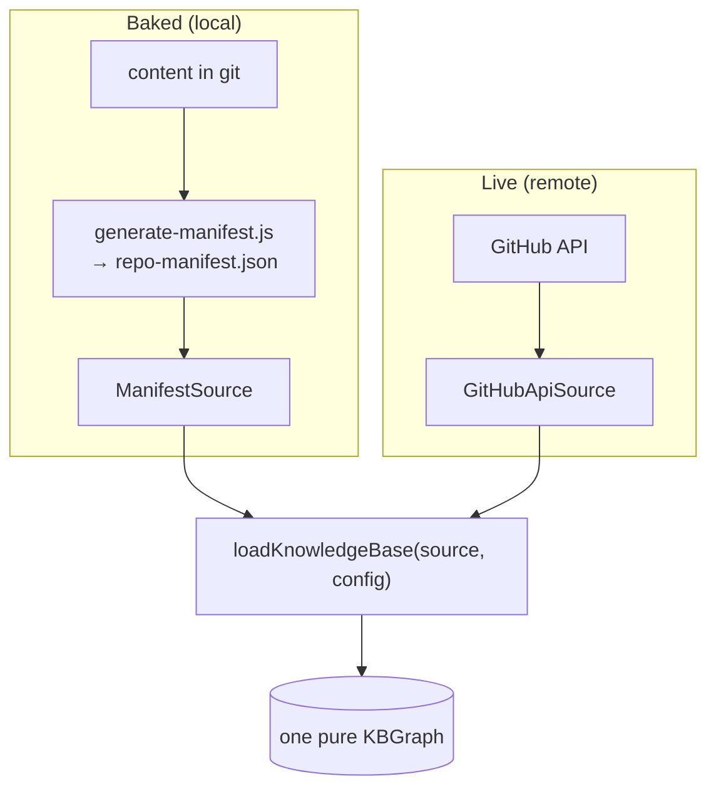

# Baked vs live

The kbx explorer runs the **same pipeline** whether it is reading a live
repository or a frozen snapshot. There is exactly one assembly path —
`loadKnowledgeBase(source, config)` — and the *only* thing that changes between a
zero-backend static deploy and a live-fetching build is **which `Source` gets
constructed**. The crux: **baked vs live is a source swap, not a code fork** —
everything downstream of the source is byte-for-byte the same.

This page is the entry point for the [graph-build set](README.md); the three that
follow zoom into the stages this one shows end to end.

## One hook, two loaders

At runtime the SPA calls a single hook,
[`useKnowledgeBase()`](https://github.com/anokye-labs/kbexplorer-template/blob/v0.4.1/src/hooks/useKnowledgeBase.ts).
It asks
[`detectLocalMode()`](https://github.com/anokye-labs/kbexplorer-template/blob/v0.4.1/src/engine/local-loader.ts)
one question — is `import.meta.env.VITE_KB_LOCAL === 'true'`? — and branches to
one of two thin loaders:

| Mode | Selected when | Loader | Source |
|------|---------------|--------|--------|
| **Local (baked)** | `VITE_KB_LOCAL=true` | [`loadLocalKnowledgeBase()`](https://github.com/anokye-labs/kbexplorer-template/blob/v0.4.1/src/engine/local-loader.ts) | [`ManifestSource`](https://github.com/anokye-labs/kbexplorer-template/blob/v0.4.1/src/engine/sources/manifest-source.ts) over the baked manifest |
| **Remote (live)** | default | [`loadRemoteKnowledgeBase()`](https://github.com/anokye-labs/kbexplorer-template/blob/v0.4.1/src/engine/remote-loader.ts) | [`GitHubApiSource`](https://github.com/anokye-labs/kbexplorer-template/blob/v0.4.1/src/engine/sources/github-api-source.ts) over the live GitHub API |

Both loaders are **thin entry points**. `loadRemoteKnowledgeBase` constructs a
`GitHubApiSource` for a resolution preset (`summary` · `standard` · `full`) and
delegates; `loadLocalKnowledgeBase` constructs a `ManifestSource` from the
imported manifest and delegates. Neither carries pipeline logic of its own —
they only decide the source, then call the same
[`loadKnowledgeBase(source, config)`](https://github.com/anokye-labs/kbexplorer-template/blob/v0.4.1/src/engine/loader.ts).

## The bake: content → manifest, at build time

Local mode reads a **build-time artifact**, not the network. Before the SPA is
bundled, `npm run prebuild` runs
[`scripts/generate-manifest.js`](https://github.com/anokye-labs/kbexplorer-template/blob/v0.4.1/scripts/generate-manifest.js),
whose `generateManifest()` walks the host repository and writes
`src/generated/repo-manifest.json`. That single JSON file captures everything a
source would otherwise fetch:

- `readConfig()` — the raw `config.yaml`.
- `readAuthoredContent()` — every `.md` under the content directory
  (`VITE_KB_PATH`, default `content/`).
- `walkFileSystem()` — the file tree; `readReadme()` — the README.
- `fetchLocalIssues()` / `fetchLocalPullRequests()` / `fetchLocalCommits()` /
  `fetchLocalBranches()` / `fetchRepoMetadata()` — read from the **local git
  checkout and `gh`**, not the API, at bake time.
- structural files, nodemap, and content-model data.

`detectHostRoot()` decides *which* repository to bake (an explicit
`VITE_KB_HOST_ROOT` always wins). The result is a frozen, self-contained
snapshot — which is why the deployed
[showcase](../../README.md#live-showcase) needs **no token and no backend**: the
graph was fully resolved before deploy.

## The live path: fetch at runtime

Remote mode skips the bake entirely. `GitHubApiSource` performs the same
retrievals against the **live GitHub REST/GraphQL API** when the page loads,
honoring the resolution preset to bound how much it pulls. A live build always
reflects the current repository, at the cost of API calls (and rate limits) on
each load.

## Where they converge

From `loadKnowledgeBase` onward the two modes are indistinguishable: the same
`source.getRepoData()` call, the same providers, the same
[`buildGraph`](providers-to-graph.md), the same
[representations](graph-to-representation.md). A baked deploy and a live build of
the same commit produce the **same graph** — the bake just moves the fetch from
page-load time to build time.

## Next

- [Sources → RepoData](sources-to-repodata.md) — what a `Source` actually
  returns, and why affordances are advertised per retrieval.
- [Providers → graph](providers-to-graph.md) — how `RepoData` becomes a pure
  graph.

---

> The four-layer model behind this is in
> [`docs/architecture.md`](../architecture.md) — see
> [Layer 3 — Engine](../architecture.md#layer-3--engine) for the same two
> loaders framed as thin wrappers over one assembly path. Code facts on this
> page are grounded against
> [`kbexplorer-template`](https://github.com/anokye-labs/kbexplorer-template) at
> tag `v0.4.1`.
