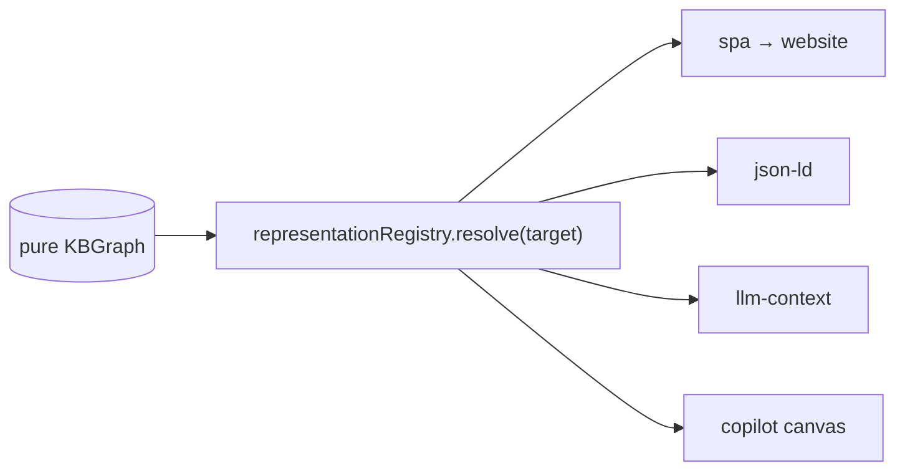

# Graph → representation

The graph is done — `{ nodes, edges, clusters, related }`, pure data. Now it has
to become something a person or an agent can actually use. kbx treats that as a
**pure function of the graph**: a `Representation` names a target and renders the
graph for it, and the four built-in targets are fully **interchangeable** behind
one registry. The crux: **the graph is data, representations are renderers** —
the same graph yields a website, a JSON-LD document, an LLM context pack, or a
canvas, and swapping targets changes nothing upstream.



This is the last stage of the [graph-build pipeline](README.md): the pure graph
from [providers → graph](providers-to-graph.md) becomes an actual surface.

## One registry, four targets

[`createDefaultRegistry()`](https://github.com/anokye-labs/kbexplorer-template/blob/v0.4.1/src/representation/targets/index.ts)
pre-populates a shared `representationRegistry` with the four built-in targets:

| Target | Renders | File |
|--------|---------|------|
| `spa` | the explorer website (React) | [`spa.tsx`](https://github.com/anokye-labs/kbexplorer-template/blob/v0.4.1/src/representation/targets/spa.tsx) |
| `json-ld` | a deterministic JSON-LD document | [`json-ld.ts`](https://github.com/anokye-labs/kbexplorer-template/blob/v0.4.1/src/representation/targets/json-ld.ts) |
| `llm-context` | a neighbour-anchored, token-budgeted Markdown pack | [`llm-context.ts`](https://github.com/anokye-labs/kbexplorer-template/blob/v0.4.1/src/representation/targets/llm-context.ts) |
| `copilot` | the embeddable canvas surface | [`copilot.tsx`](https://github.com/anokye-labs/kbexplorer-template/blob/v0.4.1/src/representation/targets/copilot.tsx) |

A [`RepresentationRegistry`](https://github.com/anokye-labs/kbexplorer-template/blob/v0.4.1/src/representation/registry.ts)
maps a target name to its implementation. `resolve(target)` returns the
representation or **throws** if none is registered — targets are addressed by
name, exactly like providers in the engine. The `Representation` contract itself
is the canonical one in
[`kbexplorer-core/src/representation.ts`](https://github.com/anokye-labs/kbexplorer-core/blob/main/src/representation.ts).

## The SPA path: from graph to DOM

The explorer website is just one `resolve` + `render`. In
[`App.tsx`](https://github.com/anokye-labs/kbexplorer-template/blob/v0.4.1/src/App.tsx):

```tsx
const spaView = representationRegistry
  .resolve('spa')
  .render(graph, { config, fluentTheme, landingPath }) as ReactNode;
```

The `spa` target's `render`
([`spa.tsx`](https://github.com/anokye-labs/kbexplorer-template/blob/v0.4.1/src/representation/targets/spa.tsx))
calls `renderSpaRoutes(graph, options)`, which returns a React Router `<Routes>`
tree over the graph:

| Route | View |
|-------|------|
| `/node/home` | `HomePage` |
| `/overview` | `OverviewView` |
| `/node/:id` | `ReadingView` (via `ReadingRoute`) |
| `/` and `*` | redirect to the resolved `landingPath` |

That element tree is mounted to the DOM by
[`main.tsx`](https://github.com/anokye-labs/kbexplorer-template/blob/v0.4.1/src/main.tsx):

```tsx
createRoot(document.getElementById('root')!).render(<StrictMode><App /></StrictMode>);
```

So the full runtime chain is: `loadKnowledgeBase` → pure `KBGraph` →
`resolve('spa').render(...)` → `<Routes>` → `createRoot(...).render(...)` → pixels.

## The purity guarantee

The reason a graph can fan out to four targets so cleanly is a hard boundary:
**the data targets never import the engine.** `json-ld` and `llm-context` are
pure functions of the `KBGraph` and its contracts — they cannot reach back into
providers, sources, or `buildGraph`. This is not a convention; it is enforced by
a guard test,
[`no-engine-import.test.ts`](https://github.com/anokye-labs/kbexplorer-template/blob/v0.4.1/src/representation/targets/__tests__/no-engine-import.test.ts).

`spa` (and `copilot`) are the intentional exemption: they legitimately render
React, so they depend on view components — but still only on the graph as their
data input. The graph never depends on any representation, and the deterministic
targets never depend on the engine. That acyclic shape is what makes "same graph,
many surfaces" true rather than aspirational.

## Full circle



From a repository's `config.yaml` and `content/`, through a source, providers,
transforms, and `buildGraph`, to a pure graph — and out to whichever surface the
moment calls for. That is how the knowledge graph is built.

## Back to the start

- [Baked vs live](baked-vs-live.md) — where the pipeline begins, and the two
  ways bytes enter it.
- [Surfaces](../surfaces.md) — the SPA and the embeddable Copilot canvas as two
  representation targets over the same graph.

---

> Representation is [Layer 4](../architecture.md#layer-4--representation) of the
> four-layer model in [`docs/architecture.md`](../architecture.md). The
> `Representation` contract is defined in
> [`kbexplorer-core/src/representation.ts`](https://github.com/anokye-labs/kbexplorer-core/blob/main/src/representation.ts).
> Template code facts are grounded against
> [`kbexplorer-template`](https://github.com/anokye-labs/kbexplorer-template) at
> tag `v0.4.1`.
