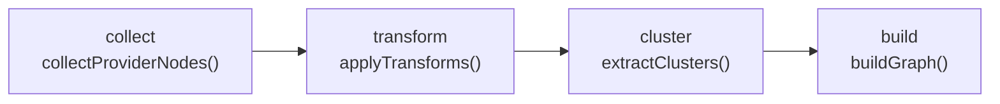

# Providers → graph

`RepoData` is a bag of normalized facts; it is not yet a graph. Turning it into
one is the engine's core job, and it happens in two moves: **providers** each
contribute nodes from their slice of the data, then **`buildGraph`** derives the
edges, repairs the topology, and indexes it. The crux: **providers declare
nodes and connections; they never build edges** — edge derivation, deduplication,
and repair are centralized in one deterministic function.

This is the second overlay stage. Its input is the `RepoData` from
[sources → RepoData](sources-to-repodata.md); its output is the pure graph that
[graph → representation](graph-to-representation.md) renders.

## registerProviders — who contributes nodes

[`registerProviders(registry, data)`](https://github.com/anokye-labs/kbexplorer-template/blob/v0.4.1/src/engine/loader.ts)
wires the built-in providers onto a `ProviderRegistry`, each conditional on what
the `RepoData` bundle actually contains:

| Provider | Contributes | From |
|----------|-------------|------|
| `FilesProvider` | file/tree nodes | `data.tree`, `data.repo` |
| `AuthoredProvider` | authored-content nodes | `data.authoredContent` / nodemap |
| `AuthoredRichMarkdownProvider` | rich-Markdown fragment nodes | `data.authoredContent` |
| `WorkProvider` | issue / PR / work nodes | work data |
| `PersonProvider` | person nodes | people data |
| `StructuralProvider` | structural-spine nodes | `data.structuralFiles` |
| `ContentModelProvider` | typed content-model nodes | `data.contentModel` |

Providers are also the **headline extension seam**: external providers declared
in `config.providers` are loaded through
[`plugin-loader`](https://github.com/anokye-labs/kbexplorer-template/blob/v0.4.1/src/engine/loader.ts)
(`loadExternalProviders`) and registered alongside the built-ins — no engine
change required. The full provider roster and their trigger conditions are
tabulated in
[architecture Layer 2](../architecture.md#layer-2--providers).

## orchestrateWithTransforms — collect, transform, cluster, build

[`orchestrateWithTransforms(registry, config, { readme })`](https://github.com/anokye-labs/kbexplorer-template/blob/v0.4.1/src/engine/orchestrator.ts)
runs four ordered phases:

1. **collect** — `collectProviderNodes()` resolves providers in **dependency
   order** (`registry.getExecutionOrder()`), threading the accumulated nodes so a
   later provider can see what earlier ones produced.
2. **transform** — `applyTransforms()` runs
   [`DEFAULT_TRANSFORMS`](https://github.com/anokye-labs/kbexplorer-template/blob/v0.4.1/src/engine/transforms.ts)
   in order (order is significant):
   - `readmeTransform` — synthesize the README node and cross-link it.
   - `issueDirectoryLinkTransform` — link each issue to directories its body
     references (**before** the split, so links stay on the original node).
   - `issueSplitTransform` — split any issue with 2+ headings into a parent plus
     a node per section.
3. **cluster** — `extractClusters()` groups nodes into clusters.
4. **build** — `buildGraph()` derives the final graph.

## buildGraph — deriving the pure graph

[`buildGraph(nodes, clusters)`](https://github.com/anokye-labs/kbexplorer-template/blob/v0.4.1/src/engine/graph.ts)
is the deterministic heart of the pipeline:

1. **access gate** — `filterAccessWithheld(nodes)` drops access-withheld nodes
   before anything is wired.
2. **node map** — a `Map<id, node>` (last-wins); a cross-provider id collision
   emits a warning, because edges and the related index resolve against this map.
3. **edges** — for each `node.connections[]`, an edge is added and deduplicated
   by a **directed semantic key** —
   `` `${from}\u0000${to}\u0000${type}\u0000${relation ?? ''}` `` — so direction,
   type, *and* relation all matter. Each `node.parent` yields a `parent → child`
   `contains` edge; weight is `conn.weight ?? getEdgeWeight(type)`.
4. **orphan reattachment** — any node with no edges is linked to a connected
   **same-cluster sibling**, or, failing that, to the **highest-degree hub**, via
   an inferred `related` edge — so the graph stays connected.
5. **related index** — `computeRelated()` builds *undirected* adjacency (keeping
   the highest weight between any pair), then ranks each node's neighbours by
   weight (tie-break: neighbour degree) and keeps the top **12**.

The result is a pure
[`KBGraph`](https://github.com/anokye-labs/kbexplorer-core/blob/main/src/graph.ts)
— `{ nodes, edges, clusters, related }` — data only, no styling and no I/O.

> **Determinism.** `buildGraph` is deterministic for a fixed node set, which is
> what lets the reference repo canonicalize the graph in golden tests. Any change
> to the flow above must regenerate those goldens.

## Next

- [Graph → representation](graph-to-representation.md) — how this one graph
  becomes a website, JSON-LD, an LLM context, or a canvas.

---

> The engine is [Layer 3](../architecture.md#layer-3--engine) of the four-layer
> model in [`docs/architecture.md`](../architecture.md). Type-level contracts
> (`KBGraph`, `KBNode`, `KBEdge`) are defined in
> [`kbexplorer-core/src/graph.ts`](https://github.com/anokye-labs/kbexplorer-core/blob/main/src/graph.ts).
> Template code facts are grounded against
> [`kbexplorer-template`](https://github.com/anokye-labs/kbexplorer-template) at
> tag `v0.4.1`.
