# Sources → RepoData

Before a single node exists, kbx has to turn a *system of record* into something
the engine can consume. That is the job of a **`Source`**: retrieve
self-describing resources, then normalize them into one `RepoData` bundle. The
crux: **a Source describes what it hands back — it doesn't just return data, it
returns data that says what you're allowed to do with it**, and it says so **per
retrieval**, never per type.

This page covers the first overlay stage from [baked vs live](baked-vs-live.md):
whichever `Source` was chosen, this is the contract it satisfies. The type-level
detail lives in the canonical contract —
[`kbexplorer-core/src/source.ts`](https://github.com/anokye-labs/kbexplorer-core/blob/main/src/source.ts)
and
[§4A of the architecture doc](../architecture.md#4a-the-source--affordance-model) —
so this page focuses on the shape of the flow rather than re-describing the
types.

## The contract

A [`Source`](https://github.com/anokye-labs/kbexplorer-core/blob/main/src/source.ts)
exposes a small surface:

- `retrieve(query)` → `Resource[]` — pull resources matching a query.
- `get(href)` (optional) — re-retrieve a single resource by its locator.
- `getRepoData()` → `Promise<RepoData>` — the **normalized bundle the engine
  consumes** (config, authored content, tree, README, issues, PRs, and so on).

Each [`Resource`](https://github.com/anokye-labs/kbexplorer-core/blob/main/src/source.ts)
carries an `href` locator for re-retrieval, an open `kind` string, its
`affordances`, and hypermedia `links`. A consumer *navigates* the returned
resources by following links — it never reconstructs URLs or infers capability
from a resource's shape.

## Affordances are advertised per retrieval

This is the idea that makes the model composable. A source declares a *possible
universe* of affordances via `possibleAffordances`, but that is **advisory
only**. The authoritative set lives on **each retrieved `Resource`**, describing
what is allowed *at the moment it was retrieved* — the same `href` can come back
later with a different set.

A consumer therefore asks
[`hasAffordance(resource, 'write')`](https://github.com/anokye-labs/kbexplorer-core/blob/main/src/source.ts)
and follows the resource's own `links` (for example, the `staging-area` link a
resource gains once it has been staged). It never assumes a capability from the
resource's *type*. The full retrieval-context table — read-only vs. writable vs.
staged — is in
[§4A](../architecture.md#4a-the-source--affordance-model).

## Git ≠ GitHub: one source, two families

[`GitHubApiSource`](https://github.com/anokye-labs/kbexplorer-template/blob/v0.4.1/src/engine/sources/github-api-source.ts)
is deliberately a **composite**. Git the version-control store and GitHub the
collaboration platform are *different systems*, and the source models them as two
resource families with non-overlapping addressing and affordances:

| Family | Addressing | Kinds | Native affordances |
|--------|-----------|-------|--------------------|
| **Git** | `git://owner/repo/…` | `file` · `tree` · `commit` · `staging-area` | `read` · `write` · `stage` |
| **GitHub** | `github://owner/repo/…` | `issue` · `pull-request` · `release` | `read` · `comment` · `close` · `merge` |

The families never bleed into each other: a pull request's `merge` affordance
never lands on a git `file`, and a git file's `stage` affordance never appears on
an issue. Because `Affordance` and `kind` are **open strings**, a new source can
introduce its own family without any engine change.

By contrast,
[`ManifestSource`](https://github.com/anokye-labs/kbexplorer-template/blob/v0.4.1/src/engine/sources/manifest-source.ts)
is a **frozen snapshot** with a single affordance posture: every resource is
`['read']` only, linked to `self` and nothing more. A baked manifest has no
staging area because there is nothing to write back to — the same contract,
honestly reporting a read-only world.

## The output: one RepoData bundle

Whichever source is in play, `getRepoData()` normalizes its retrievals into the
one [`RepoData`](https://github.com/anokye-labs/kbexplorer-core/blob/main/src/source.ts)
bundle the engine expects. That bundle is the hand-off point to the next stage —
the providers turn it into graph nodes.

`RepoData` carries a mix of shapes: authored **Markdown**, the structured
**content model** (typed YAML + JSON-LD context), **structural** files
(`.github/**`, `CODEOWNERS`), and a **thin file tree** (paths, not contents).
Which file types actually become nodes — and how a `.docx` or `.txt` gets in via
`kbx derive` or a bring-your-own provider — is covered in
[providers → graph → *What about non-markdown files?*](providers-to-graph.md#what-about-non-markdown-files).

## Next

- [Providers → graph](providers-to-graph.md) — how `RepoData` becomes a pure
  `KBGraph`.
- Back to [baked vs live](baked-vs-live.md) for where the two sources are
  chosen.

---

> Source, Resource, Affordance, and the staging model are defined once, in
> [`kbexplorer-core/src/source.ts`](https://github.com/anokye-labs/kbexplorer-core/blob/main/src/source.ts);
> [`docs/architecture.md` §4A](../architecture.md#4a-the-source--affordance-model)
> is the reference narrative. Template code facts are grounded against
> [`kbexplorer-template`](https://github.com/anokye-labs/kbexplorer-template) at
> tag `v0.4.1`.
