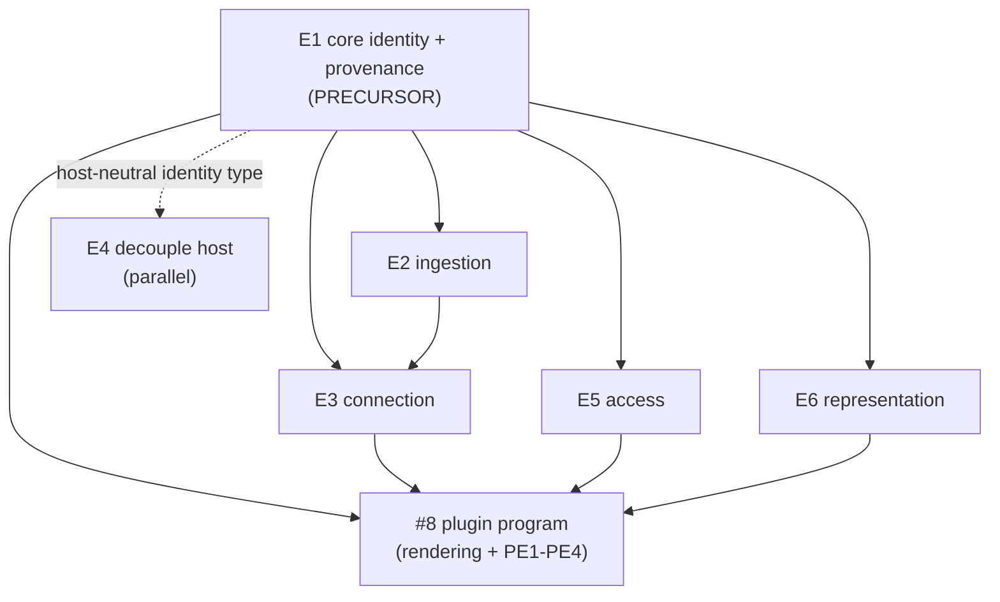

# Roadmap & program

kbx is built as **two peer programs** over one engine, sequenced by a single
cross-repo, wave-by-wave plan. This page is the map; the authoritative, living detail
is in the linked issues.

- **Foundation** (substrate) — [#13](https://github.com/anokye-labs/kbexplorer/issues/13):
  *many sources → one trustworthy graph, stored in git.*
- **Plugin** (surface) — [#8](https://github.com/anokye-labs/kbexplorer/issues/8):
  *a Copilot plugin — commands + agents + skill + canvas + MCP — over that graph.*
- **Demand map** — [#23](https://github.com/anokye-labs/kbexplorer/issues/23): the
  [user stories](user-stories.md) and [journeys](journeys.md) the programs serve.
- **Execution plan** — [#90](https://github.com/anokye-labs/kbexplorer/issues/90): the
  full wave-by-wave sequence (rubber-duck validated). The summary below tracks it.
- **Requirements & vision** — [#12](https://github.com/anokye-labs/kbexplorer/issues/12).

> **North star:** the bespoke Copilot canvas renders **and acts on** a trustworthy,
> heterogeneous-source KBGraph — provenance-bearing, identity-unified, access-labeled —
> all stored in git.

---

## The two programs

### Foundation — [#13](https://github.com/anokye-labs/kbexplorer/issues/13)

| Epic | What | Repo |
|---|---|---|
| **E1** [core#18](https://github.com/anokye-labs/kbexplorer-core/issues/18) | Configurable, source-agnostic identity + provenance. **The precursor.** | kbexplorer-core |
| **E2** [cli#132](https://github.com/anokye-labs/kbexplorer-cli/issues/132) | File-based ingestion + providers | kbexplorer-cli |
| **E3** [#15](https://github.com/anokye-labs/kbexplorer/issues/15) | Cross-source **connection** (edge-mint, conflation, precedence) | cli (+ thin core) |
| **E4** [#16](https://github.com/anokye-labs/kbexplorer/issues/16) | Decouple GitHub-the-host (git stays the store) | cli + template |
| **E5** [#17](https://github.com/anokye-labs/kbexplorer/issues/17) | Access labeling (kbx labels; host enforces) | core + consumers |
| **E6** [template#426](https://github.com/anokye-labs/kbexplorer-template/issues/426) | Representation — rich-Markdown rendering + lenses | kbexplorer-template |

### Plugin — [#8](https://github.com/anokye-labs/kbexplorer/issues/8)

| Sub-tree | What | Repo |
|---|---|---|
| **Rendering** [template#401](https://github.com/anokye-labs/kbexplorer-template/issues/401) / [#407](https://github.com/anokye-labs/kbexplorer-template/issues/407) | Host-themeable canvas + the bespoke agent-driven surface | template (+ core#15/#16) |
| **PE1** [#19](https://github.com/anokye-labs/kbexplorer/issues/19) | Plugin packaging + command surface | cli |
| **PE2** [#20](https://github.com/anokye-labs/kbexplorer/issues/20) | Guided genesis / onboarding | cli + template |
| **PE3** [#21](https://github.com/anokye-labs/kbexplorer/issues/21) | MCP do-seam + job layer + consent | cli |
| **PE4** [#22](https://github.com/anokye-labs/kbexplorer/issues/22) | Source-drift + generated-content review | cli + template |



The plugin **consumes** the foundation: the bespoke canvas reuses the Representation
seam, host-neutral identity, connection edges, and access labels rather than
re-deriving them.

---

## Critical path

```
E1.P1 (ship kbexplorer-core release)
   → cli#133 (rich-Markdown provider)
   → cli#134 (composite ingestion)
   → cli#136 (affected-dispatch)  (+ core#25 identity claims)
   → E3  (cli#137–#140 connection)
```

Everything else — E4 entirely, E5, E1's later phases, breadth adapters, the plugin
spine — rides parallel lanes off this spine. The `E1 → {E2, E3, E5}` and
`PE3 → MCP` edges are **package-release gates**: consumers code against a *published*
kbexplorer-core, not an unmerged branch.

---

## Waves (summary of [#90](https://github.com/anokye-labs/kbexplorer/issues/90))

| Wave | Lands | Gated on |
|---|---|---|
| **0a — Core unlock** | E1.P1 (core#19/#20/#21/#22) → **core release**; parallel cli#141, core#15/#16 | nothing |
| **0b — First visible slice** | cli#133, template#427, showcase #14 | 0a release |
| **1 — Plugin spine + theming** | PE3 cli#153/#156, PE1 cli#145/#146, theming template#402–404; E1 core#23/#24 | 0a (+ template#427 for theming) |
| **2 — Ingest + label + job layer + bespoke skeleton + early genesis** | cli#134→#136, PE1 cli#147, PE3 cli#154, #407 skeleton, E5 core#28→cli#144, PE2 cli#149/#150/#152, E1 core#25/#26/#27 | W1 |
| **3 — Connect + governance + genesis surface** | **E3 cli#137–#140**, search#9→cli#151, core#29, template#428, PE3 cli#155, #407 rest | W2 |
| **4 — Trust loop + host breadth + polish** | E4.P2–4, PE4 (drift→review), cli#135, cli#148, #8 thin surfacing | W3 |

**Backlog — candidate new epic E7 (Time & provenance):** bitemporal + as-of + PROV-O
propagation. Demand is the [**K** story family](user-stories.md#k--time--provenance-semantic-space-time)
([#32](https://github.com/anokye-labs/kbexplorer/issues/32)), surfaced by
[#12](https://github.com/anokye-labs/kbexplorer/issues/12)'s discussion. This is
**genuinely new core work** not covered by E1–E6 and needs its own epic before
scheduling.

---

## Demand → supply traceability

Every [user story](user-stories.md) names the issue(s) that deliver it; every
foundation/plugin epic traces back to the requirements in
[#12](https://github.com/anokye-labs/kbexplorer/issues/12). The result is a closed
loop: a reader (human or agent) can start from *a person's need* and walk to *the code
that satisfies it*, or start from *an epic* and find *who it is for*.
