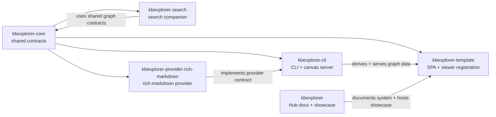

# KBX System Guide

This is the hub-local system guide for the KBX stack. It is intentionally scoped to the repository topology and architecture that are verifiable in this repo: the overall narrative, the showcase, and the contract-level relationships that the hub docs describe.

The goal is to establish a durable structure for the KBX system as a multi-repository project without inventing package-local internals that belong to other repos. When package-local documentation lands, it can enrich this guide with repo-specific sections and cross-links rather than duplicating the contracts already defined in `kbexplorer-core`.

## Ownership and scope

This repo owns the public documentation layer and the deployed showcase. It contains the system narrative, architecture docs, design decisions, and the rendered sample knowledge base. The runtime implementation lives elsewhere.

The repository set described in this repo is:

- [`kbexplorer`](https://github.com/anokye-labs/kbexplorer) — the docs + showcase hub.
- [`kbexplorer-core`](https://github.com/anokye-labs/kbexplorer-core) — shared contracts, identity helpers, relation taxonomy, JSON-LD helpers, and the source/provider/representation seams.
- [`kbexplorer-cli`](https://github.com/anokye-labs/kbexplorer-cli) — the CLI that derives content, drives the explorer, and serves the embeddable Copilot canvas.
- [`kbexplorer-template`](https://github.com/anokye-labs/kbexplorer-template) — the SPA that renders a knowledge graph in the browser and includes the embeddable canvas entry.
- [`kbexplorer-search`](https://github.com/anokye-labs/kbexplorer-search) — the semantic-search companion module.
- [`kbexplorer-provider-rich-markdown`](https://github.com/anokye-labs/kbexplorer-provider-rich-markdown) — the loadable rich-Markdown provider that ingests a document into a graph fragment.

This is the repository topology that the hub documents explicitly support. It is the contract for how this system is described here, and it is deliberately narrower than any package-local implementation detail available only in those repos.

## Repository topology

The dependency direction is intentionally clear:

- `kbexplorer-core` is the shared type and interface layer.
- package runtimes build on those contracts rather than on one another.
- the hub repo owns narrative, showcase hosting, and system-level documentation.

## Canonical system guide structure

This guide defines the structure for package-local and hub-local documentation that belongs in KBX. Future package docs can slot into this without duplicating the architecture narrative.

### 1. Purpose and scope

Describe what a package is and what problem in the KBX stack it solves. State whether it is a contract package, runtime package, representation package, integration package, or a support package.

### 2. Role within the KBX topology

Explain where the package fits in the multi-repo graph. Always anchor the description to a major KBX boundary:

- contract layer (`kbexplorer-core`)
- source/provider/engine boundary
- representation layer
- search layer
- host/showcase layer

### 3. Interfaces and contracts

Every package guide should point to the canonical contract(s) in `kbexplorer-core` rather than restating types. This keeps the system coherent and prevents drift between repos.

### 4. Runtime or processing flow

Describe the actual flow the package contributes to the system in a small, plain-English sequence. If possible, encode it as a Mermaid diagram with a single, narrow purpose: graph-building, search integration, rendering, or content ingestion.

### 5. Dependencies and data boundaries

Capture the package's dependencies and explicitly describe any data it expects to receive, produces, or re-exports. This section is where the package guide should clarify what interfaces are intentionally shared and what remains private.

### 6. Files and modules worth reading

Each guide should list the most relevant modules or docs for a newcomer. This keeps package-level onboarding readable without forcing a full code walk.

### 7. Verification and relationship to the hub docs

Document how the package is validated and which hub docs are authoritative for cross-repo context. This should include links to the hub-level system docs, not an independent rewrite of the same material.

### 8. Cross-links for future enrichment

This section is reserved for later package-local PR results. It can include links like: package contract references, CLI docs, representation docs, provider docs, or search docs as they land. The hub guide remains the index; package docs enrich the detail.

## Hub-owned documentation structure

The hub repo already contains the canonical narrative and the system-level map. The ownership pattern is:

- [`docs/architecture.md`](architecture.md) — the core architecture and four-layer model.
- [`docs/graph-build/`](graph-build/README.md) — step-by-step graph construction flow.
- [`docs/surfaces.md`](surfaces.md) — the two representation surfaces.
- [`docs/history.md`](history.md) — dated chronology and what actually shipped.
- [`docs/decisions/`](decisions/) — preserved decisions and open questions.
- [`docs/canvas-dev-loop.md`](canvas-dev-loop.md) — local iteration for the embedded canvas.
- [`docs/adoption-paved-path.md`](adoption-paved-path.md) — onboarding and adoption guidance.

This is the stable scale of hub ownership: a documentation and showcase layer that explains the whole system and grounds implementation detail in the package repos.

## Integration points for future package-local PRs

The hub guide intentionally leaves room for package-level documentation to be folded in later. Upcoming package-local docs should plug into the following integration points:

- architecture references: cross-link to the canonical four-layer model in [`docs/architecture.md`](architecture.md)
- contract references: cite the canonical contracts in `kbexplorer-core` rather than duplicating them
- graph-build references: link package-level contributions to the graph pipeline described in [`docs/graph-build/`](graph-build/README.md)
- representation references: connect package-specific renderers or adapters to [`docs/surfaces.md`](surfaces.md)
- search references: connect search-specific docs to the search-first-class representation section in [`docs/architecture.md`](architecture.md)
- package onboarding references: keep any package-local guides brief and additive, not self-contained rewrites of the whole system

This ensures the hub guide remains the durable index while package docs add precision as they land.

## Summary

KBX is a multi-repository system whose design is centered on a single contract layer: `kbexplorer-core`. The hub repo owns the explanatory and showcase layer, while runtime branches and providers live in dedicated package repos. This page gives the hub a durable canonical structure for that system-level story and creates a safe insertion point for the package documentation PRs that will later enrich the guide.
