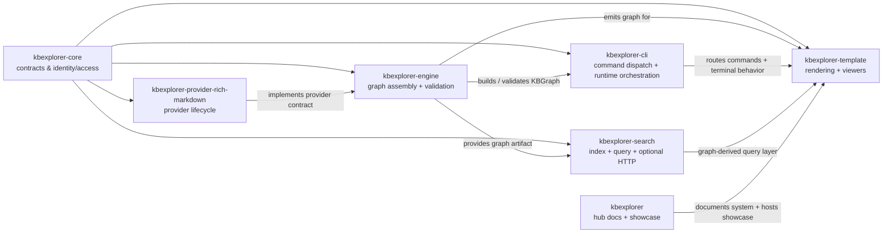
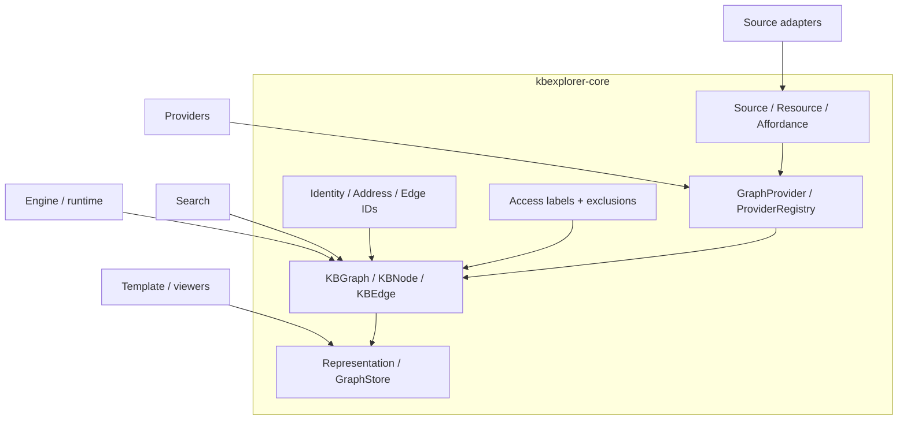
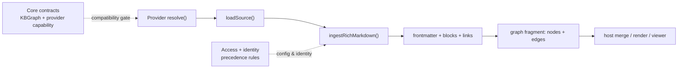
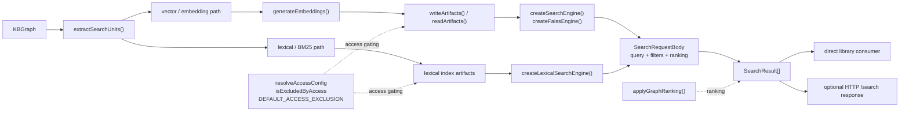
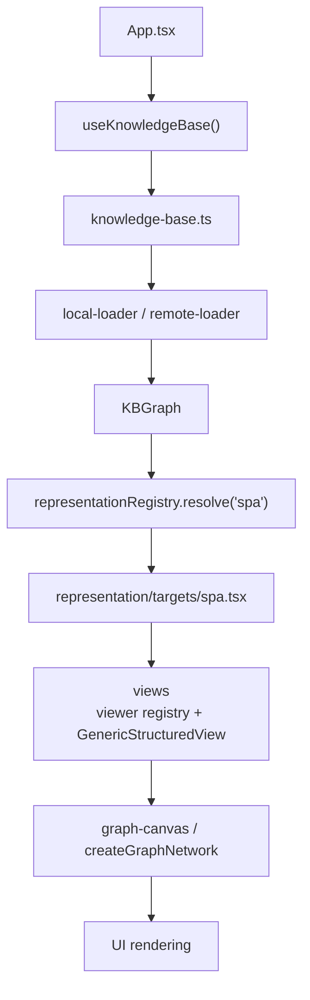
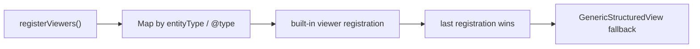
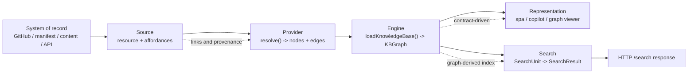

# KBX System Architecture and Internals

This guide is the hub-level system reference for the KBX stack. It brings together the verified architecture documents already in this repo and the package-local documentation that has landed in the sister repos, without inventing implementation details that were not independently verified.

This is a multi-repository system, not a single-package project. The contracts live in `kbexplorer-core`; the runtime and integration packages implement or consume those contracts; the hub repo owns the system narrative, docs, and showcase host. The purpose of this guide is to make that topology explicit and durable.

## Scope and authority

This document treats these sources as authoritative:

- the hub docs in this repo: [`docs/architecture.md`](architecture.md), [`docs/graph-build/`](graph-build/README.md), [`docs/surfaces.md`](surfaces.md), [`docs/history.md`](history.md), and related design docs
- verified package-local documentation from:
  - `kbexplorer-core` PR 81
  - `kbexplorer-search` PR 32
  - `kbexplorer-provider-rich-markdown` PR 18
  - `kbexplorer-template` PR 571
- the package contracts and source paths that are already linked from the hub docs and package docs

This guide distinguishes carefully between:

- established contracts: the shared types and interfaces defined in `kbexplorer-core`
- high-level architectural roles: what each repo is responsible for in the system
- package-local implementation details: only included when the corresponding repo documentation has been verified and linked

Where the Engine or CLI docs could not be created or queried in a live session, this guide names only the already-confirmed high-level role and points to repo-local references rather than restating unverified internal APIs.

## 1. System purpose and principles

KBX turns a system of record into a pure knowledge graph and then renders or queries that graph for multiple consumers. The core idea is not a bespoke app; it is a layered architecture built around a shared contract boundary.

The governing principles are:

- Shared contracts first: `kbexplorer-core` defines the graph, source, provider, identity, access, and representation seams.
- One-way dependency flow: sources feed providers, providers build graphs, representations consume graphs, and search is an additional graph-derived representation.
- Graph as the canonical artifact: downstream consumers should operate on a normalized graph rather than on raw source objects.
- Separation of concerns: the hub repo describes the system; package repos implement runtime behavior and specialized adapters.
- Compatibility and access boundaries: the system relies on compatibility checks and access labels rather than implicit behavior.

The hub docs already state the architectural shape in four layers: Sources → Providers → Engine → Representation. That remains the base model, and the package-local docs add concrete detail for search, rich Markdown ingestion, and the Template renderer.

## 2. Repository and package map

The verified repository topology for KBX is:

- [`kbexplorer`](https://github.com/anokye-labs/kbexplorer) — docs, showcase host, public architecture narrative, and integration hub
- [`kbexplorer-core`](https://github.com/anokye-labs/kbexplorer-core) — dependency-free contracts and canonical types
- [`kbexplorer-engine`](https://github.com/anokye-labs/kbexplorer-engine) — graph assembly runtime that resolves providers, orchestrates graph generation, validates/assesses the graph, and emits the canonical `KBGraph`
- [`kbexplorer-search`](https://github.com/anokye-labs/kbexplorer-search) — indexing/query/search companion built over graph data, with vector/embedding and lexical/BM25 alternative paths
- [`kbexplorer-provider-rich-markdown`](https://github.com/anokye-labs/kbexplorer-provider-rich-markdown) — provider that ingests rich Markdown into graph fragments
- [`kbexplorer-cli`](https://github.com/anokye-labs/kbexplorer-cli) — CLI and runtime orchestration layer for command dispatch, local graph utilities, search commands, and MCP/terminal integration
- [`kbexplorer-template`](https://github.com/anokye-labs/kbexplorer-template) — the browser rendering layer, viewer registration, and built-in representation targets

This dependency direction matters:

- `kbexplorer-core` is the contract root.
- runtime packages consume those contracts rather than each other’s implementation types.
- the hub repo does not own the runtime engine; it documents the overall system and public showcase.

## 3. Established contracts: Core graph, provider, identity, access, and representation

The core package is the canonical contract layer. The verified public graph contracts include:

- `KBNode`, `KBEdge`, `KBGraph`
- `NodeSource`, `JsonLd`, `Connection`, `NodeLens`, `Cluster`
- `Source`, `Resource`, `Affordance`, `STAGING_AREA_REL`
- `GraphProvider`, `ProviderRegistry`, `ProviderModule`, `ProviderCapability`, `PROVIDER_API_VERSION`, `checkProviderCompatibility`
- `buildAddress` / `parseAddress`, `buildId` / `buildEdgeId`
- `KBAccessLabel`, `AccessConfig`, default access exclusion
- `Representation`, `RepresentationTarget`, `CANVAS_TARGET`, `GraphStore`, `formatGraphStoreCacheKey`

The verified Core invariants reported in the package docs are:

- dependency-free, side-effect-free contracts
- opaque identity body; identity is not treated as a mutable “display field”
- access policy is label-based and kept separate from the graph node/edge payload
- compatibility checks use API/version and capability gating, not hidden runtime assumptions
- one-way type flow: source → provider → graph → representation
- Core does not own UI/rendering behavior; it provides the contract layer other packages consume

This is the boundary that keeps the whole system coherent: rich Markdown libraries, search modules, the CLI, and the template can each be independently swapped or extended, provided they honor the Core contract layer.

### Core boundary diagram

## 4. Engine responsibilities: graph assembly, validation, and provider execution

The Engine is the runtime assembly path that resolves providers, orchestrates graph creation, and emits a pure `KBGraph`. Verified source evidence from `kbexplorer-engine` shows the package exports and responsibilities directly:

- `src/index.ts` re-exports `ProviderRegistry`, `GraphProvider`, `ProviderResult`, `registerProviders`, `loadKnowledgeBase`, `validateGraph`, `assessGraph`, `buildManifest`, and the catalogue helpers `deriveNeeds`, `compareContent`, and `enrichFromManifest`.
- `src/providers.ts` defines `ProviderRegistry` and `getExecutionOrder()`, which orders providers by dependency-safe execution order before graph assembly.
- `src/loader.ts` defines `registerProviders(registry, data)` and `loadKnowledgeBase(source, config)`, showing that the engine wires providers from normalized `RepoData` and then runs the shared transform stage.
- `src/orchestrator.ts` exports `collectProviderNodes` and `orchestrate`, which are the graph-orchestration functions and make the assembly role explicit.
- `buildManifest` and the catalogue helpers are not UI code; they are pure data-shaping utilities that operate on graph/source data and then hand the result to downstream consumers.

The protected boundary is important:

- the Engine is not a place for UI or presentation logic
- the Engine composes provider output into a graph and exposes the pure graph artifact downstream
- the Engine is the runtime glue between source adapters and representation consumers
- graph validation, assessment, manifest creation, and catalogue derivation are all engine-side responsibilities, not CLI-owned behavior

The package-local source also distinguishes the engine from the CLI: the engine is the code that creates and validates the graph, while the CLI handles command routing and terminal/runtime behaviors around that graph. This is the correct boundary to preserve in the doc set and is supported by the sibling repo exports and runtime structure.

## 5. Provider lifecycle and the Rich Markdown graph-fragment model

The provider lifecycle is a critical part of the KBX system. The verified provider docs identify the key runtime flow: `resolve()` → `loadSource()` → `ingestRichMarkdown()` → `{ nodes, edges }`.

### Verified provider contracts and semantics

From `kbexplorer-provider-rich-markdown` PR 18, the provider root export contract includes:

- `defineProvider`
- `apiVersion`
- `capabilities`
- `resolveIdentityOptions`
- `RichMarkdownError`
- `RichMarkdownErrorCode`

The concrete library API includes:

- `ingestRichMarkdown`
- `parseRichFrontmatter`
- `extractEmbeddedBlocks`
- `extractLinkEdges`
- `makeSourceRef`
- `RICH_MARKDOWN_BLOCK_LANGS`

These are important semantic rules:

- the pure library performs no filesystem or network I/O
- config and identity precedence are resolved intentionally before graph output is assembled
- `node.id` differs from `node.identity`
- `sourceRef` captures provenance
- embedded languages are restricted to deterministic set such as `dot`, `mermaid`, `ics`, and `canvas`
- content handling is deterministic and constrained; the library is a pure ingestion stage, not a rendering runtime

### Provider lifecycle diagram

This is a good example of the contract-and-runtime split: the provider implements Core contract logic for a graph fragment, while the host or engine decides how that fragment merges into the broader knowledge base.

### Rich Markdown model

The verified semantics show the Rich Markdown provider acts as a graph-fragment producer, not a rendering engine. The path is: frontmatter and prose become node construction; embedded blocks are extracted; link edges are mapped; the fragment is merged into the host tree; and the representation layer renders it.

This separation is important: the provider is responsible for structured graph extraction, while the Template layer still owns the view and rendering surface.

## 6. Search indexing, query, and HTTP data flow

The verified `kbexplorer-search` package docs show a concrete search pipeline that is graph-derived, with search artifacts and query results available in library code as well as optional HTTP serving.

The key public APIs and types identified in the package docs are:

- `extractSearchUnits`
- `generateEmbeddings`
- `writeArtifacts` / `readArtifacts`
- `computeContentHash`
- `createSearchEngine`
- `createLexicalSearchEngine`
- `createFaissEngine`
- `createSearchServer`
- `registerProvider` / `getProvider` / `listProviders`
- `resolveAccessConfig` / `isExcludedByAccess`
- `DEFAULT_ACCESS_EXCLUSION`
- `applyGraphRanking`
- `SearchUnit`, `SearchResult`, `SearchOptions`, `EmbeddingArtifact`, `IndexMeta`, `LexicalIndex`, `SearchEngine`, `SearchRequestBody`

The important correction is that search is not a single mandatory data path. The architecture supports alternative or complementary strategies:

- vector / embedding-based search via `generateEmbeddings()` / `createFaissEngine()` / `writeArtifacts()`
- lexical / BM25-style search via `createLexicalSearchEngine()` and lexical indices
- both produce `SearchResult[]` for consumers, and either path may feed an optional HTTP server layer

The verified flow is therefore not “embeddings + `/search` are required for all deployments”; instead it is:

`KBGraph` → `extractSearchUnits()` → `SearchUnit[]` → vector or lexical artifacts/indexes → `SearchResult[]` → optional HTTP `/search` or direct library consumption

### Search pipeline diagram

This search layer is intentionally a graph-derived representation, not the canonical source of truth. It operates on graph-derived artifacts and can be exposed directly to library clients or through an optional search HTTP server without implying that embeddings or HTTP access are mandatory architecture requirements for every deployment.

## 7. CLI role: command dispatcher and runtime router

The CLI is the shell-facing orchestration layer. Verified source evidence from `kbexplorer-cli` shows it is a dispatcher layer around the engine and the runtime packages, not the place where the graph is assembled.

The canonical evidence is clear:

- `bin/cli.js` is a tiny entrypoint that imports `./kbx.js`, which is the runtime bootstrap for the command surface.
- `src/cli.ts` is the command router / runtime integration layer responsible for dispatching commands and local runtime behavior.
- the documented command surface includes commands such as `init`, `generate`, `dev`, `build`, `manifest`, `update`, `links`, `audit`, `validate`, `affected`, `scaffold`, `derive`, `connect`, `sync`, `doctor`, `plugin`, `search-index`, `search`, and `mcp`.
- the runtime contract distinguishes between a command surface and a router: command logic is bound to a runtime dispatcher, while the actual graph assembly and validation belongs to the engine package.
- the CLI docs also describe a `manifest` template-script-first flow with a `generateManifest` fallback, plus local graph utilities and search/index commands; they do not attribute graph construction to the CLI itself.
- the MCP server is injected as an SDK-neutral server registration function, which is a runtime integration concern rather than a graph-building responsibility.

This means the CLI is responsible for:

- exposing the user-facing command surface
- routing commands to the relevant runtime path
- handling terminal output, exit behavior, and local process-level workflows
- integrating with manifest generation, search, plugin, and MCP runtime surfaces

It is not the canonical graph-building layer. The graph build, provider resolution, validation, assessment, and manifest shaping are engine responsibilities. The CLI is the layer that calls into those functions and surfaces them through local commands and terminal behavior.

## 8. Template loading, rendering, and viewer architecture

The verified Template documentation PR 571 establishes the core application flow:

`App.tsx` → `useKnowledgeBase()` → `knowledge-base.ts` → `local-loader` / `remote-loader` → `representationRegistry.resolve('spa')` → `representation/targets/spa.tsx` → views → `graph-canvas` / `createGraphNetwork`

The template architecture is defined by two registries:

- `representationRegistry`: a `Map` containing built-in targets; resolves targets by name
- `viewer registry`: `registerViewers` uses last-registration-wins semantics and maps built-ins by `entityType` / `@type`; it falls back to `GenericStructuredView`

This is a strong example of the “contract + implementation” split:

- the Core layer defines representation contracts
- the Template package provides concrete rendering and viewer registration
- the host app chooses which representation target to resolve and which graph data to feed it

### Template rendering sequence

### Viewer registration model

This is the concrete Template-side application of the broader system architecture: the graph is the canonical artifact, and the viewer registry decides how to render each node or entity within that graph.

## 9. End-to-end data representations and flows

The system is best understood as a chain of transformations. The same conceptual object is represented differently at each stage:

1. Source layer: system-of-record resources, with affordances and links
2. Provider layer: graph fragments composed of nodes and edges
3. Engine layer: merged pure `KBGraph`
4. Search layer: graph-derived `SearchUnit` and query artifacts
5. Representation layer: views, graphs, and interaction surfaces

### End-to-end flow diagram

This gives the system its key invariant: the graph is the canonical artifact; search, rendering, and agent surfaces are all downstream consumers of that graph rather than independent data models.

## 10. Extensibility and compatibility rules

The verified docs consistently emphasize a few core extension rules:

- Providers are swappable as long as they honor the Core provider contract.
- Representation targets are swappable as long as they honor the Core representation contract.
- Search is a graph-derived representation; it can be extended by provider registration or engine selection logic.
- Access and compatibility checks are part of the contract, not side channels.
- The Template package uses explicit registry structures, not implicit conventions, for viewer and target registration.

The most important rule is that the system is designed for composability around the Core contract layer rather than around any one repo implementation.

## 11. Build and release package topology

The hub repo also defines the public release topology for the showcase and documentation layer. In the verified workflow file, the showcase build checks out the pinned template release and the host repo content, then builds the template in local mode against the host content.

This is the visible separation:

- hub repo = host content and docs
- template repo = renderer and representation package
- package repos = contract/runtime/search/provider logic
- release pins can differ by repo and are intentionally managed rather than assumed to be the same version across the stack

This is why the system is best treated as a package topology rather than a monorepo.

## 12. Glossary

- KBGraph: the canonical pure graph artifact the system assembles and consumes.
- Source: the adapter that retrieves self-describing resources from a system of record.
- Provider: the graph-fragment producer that converts resources into nodes and edges.
- Representation: the downstream consumer that renders or exposes a graph for a target surface.
- Search representation: a graph-derived query layer that produces ranked search results from the graph.
- Access label: the label-based policy mechanism used to gate graph exposure and search output.
- Provider compatibility: the version/capability check that ensures a provider matches the expected contract layer.
- Graph fragment: a partial set of nodes and edges produced by an individual provider before merging into the full graph.
- Node identity: the canonical identity field that remains distinct from the display or source-local IDs.
- Source provenance: the tracking metadata that explains where a node or edge came from.

## 13. Repo-local references and next enrichment points

The hub guide deliberately points to real package-local docs instead of re-describing them.

Core references:

- [`kbexplorer-core` contracts and public exports](https://github.com/anokye-labs/kbexplorer-core)
- [`kbexplorer-core` contract docs (PR 81)](https://github.com/anokye-labs/kbexplorer-core/pull/81)

Search references:

- [`kbexplorer-search` package docs (PR 32)](https://github.com/anokye-labs/kbexplorer-search/pull/32)

Provider references:

- [`kbexplorer-provider-rich-markdown` package docs (PR 18)](https://github.com/anokye-labs/kbexplorer-provider-rich-markdown/pull/18)

Template references:

- [`kbexplorer-template` docs PR 571](https://github.com/anokye-labs/kbexplorer-template/pull/571)
- [`kbexplorer-template` companion docs and source paths](https://github.com/anokye-labs/kbexplorer-template)

Hub references:

- [`docs/architecture.md`](architecture.md)
- [`docs/graph-build/`](graph-build/README.md)
- [`docs/surfaces.md`](surfaces.md)
- [`docs/history.md`](history.md)

This is the durable shape for the future: hub docs define the system-level architecture; package docs add implementation precision without creating competing system narratives.

## Summary

KBX is a multi-repository system whose canonical contract layer is `kbexplorer-core`, whose runtime packages apply or consume those contracts, and whose hub repo explains the overall architecture and hosts the public showcase. The verified docs from Core, Search, Provider, and Template document the actual package boundaries and data flow, and this guide consolidates them into one coherent architecture without inventing deeper Engine or CLI internals that were not independently available.
