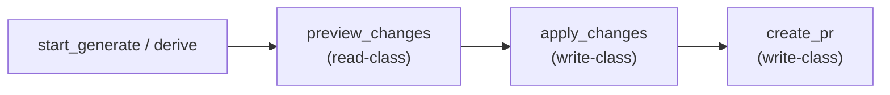

# Human approval workflow

How a change to the dataset gets human sign-off via a pull request: the
affordance-driven `create_pr` path, the `refs #N` convention, and the explicit
rule that conflation/entity-merge changes are **always** human-approved. The
crux: **a change is a reviewable proposal routed to the right authority, never
a silent clobber** — and that holds identically for a human's edit and for
agent-generated content.


For the CI gates that PRs must satisfy, see
[governance with rulesets](rulesets-and-automation.md). For the broader
context of _why_ changes go through PRs, see
[user-stories.md](../user-stories.md).

## The `create_pr` affordance

The kbx do-seam
([architecture.md -> do-seam](../architecture.md#the-do-seam--affordances-as-a-protocol-neutral-action-layer))
exposes a `create_pr` affordance as the final step of a workflow that modifies
the dataset. The flow is:



### How it works

1. A long-running job (`start_generate` or `derive`) produces a change set.
2. `preview_changes` (read-class, no consent needed) returns the diff.
3. `apply_changes` (write-class, consent-gated) writes the changes to the
   worktree.
4. `create_pr` (write-class, consent-gated) opens a pull request for the
   applied changes.

`create_pr` does **not** own git or the GitHub API. The actual PR creation is
supplied by the caller through `context.seams.createPullRequest`
([`src/affordances/jobs/create-pr.js`](https://github.com/anokye-labs/kbexplorer-cli/blob/main/src/affordances/jobs/create-pr.js)).
When that seam is absent, the action reports a typed `UNSUPPORTED` error. The
GitHub implementation delegates to `gh pr create` via the
[`ChangeProposalAdapter`](https://github.com/anokye-labs/kbexplorer-cli/blob/main/src/lib/change-proposal-adapter.js),
which also has a bare-git fallback (patch + branch name, no forge).

### Consent gate

Every write-class affordance — including `create_pr` — is subject to the
consent gate
([`src/affordances/consent.js`](https://github.com/anokye-labs/kbexplorer-cli/blob/main/src/affordances/consent.js)):

- **Fail-closed default**: if no `requestConsent` seam is wired and no
  explicit `consentPolicy: 'allow'`, the gate refuses with
  `CONSENT_REQUIRED`.
- The disclosure is deterministic and lists the credential _names_ (never
  values) and the write targets (branch, PR title).
- A host opts into non-interactive execution via
  `context.seams.consentPolicy = 'allow'`.

The consent gate is enforced **once, at the action core**
(`executeAffordance` in
[`src/affordances/index.js`](https://github.com/anokye-labs/kbexplorer-cli/blob/main/src/affordances/index.js)),
so all three delivery adapters (extension-tool, MCP, canvas) inherit identical
behavior.

### The staging area link

Resources that have been staged carry a hypermedia link back to the staging
area:

```ts
links: [{ rel: STAGING_AREA_REL /* 'staging-area' */, href: 'git://...' }]
```

The [`stagingAreaLink(resource)`](https://github.com/anokye-labs/kbexplorer-core/blob/main/src/source.ts)
accessor (part of the core contract) lets any consumer discover and
re-retrieve the staging area generically — the same mechanism the `create_pr`
flow relies on to know _where_ the changes live.

## Issue references: `refs #N`, never `closes #N`

Every repo in the kbx org follows this convention (documented in each repo's
`AGENTS.md`):

- **Commit messages** use `refs #N` to link to the issue without triggering
  GitHub's auto-close keywords. An early commit's auto-close would close an
  issue before the rest of the branch (and its review) is done.
- **PR descriptions** may use `Closes #N` once the PR is genuinely ready to
  merge and review confirms the issue is fully addressed — that is a
  deliberate, reviewed decision.
- **Verification before close**: never close an issue on the strength of "a
  commit referencing it merged" alone. Confirm the fix actually works, then
  close explicitly citing the evidence (a file and line, a check-run URL, a
  fetched page).

## The conflation carve-out

**Any conflation or entity-merge change is ALWAYS a human-approved PR.**

This is an explicit, non-negotiable rule the maintainer has set
([kbexplorer#113](https://github.com/anokye-labs/kbexplorer/issues/113),
[kbexplorer#114](https://github.com/anokye-labs/kbexplorer/issues/114)):

- A conflation (merging two graph entities that represent the same real-world
  thing via same-as claims) is **never auto-applied, never auto-merged**.
- It **must** be exempted from the org's zero-approval bot auto-merge path
  (`auto-merge.yml` in every repo).
- The human reviews the merge claim, confirms the entities are genuinely the
  same, and approves.

### Why

Cross-source conflation
([`docs/decisions/conflation-correction.md`](../decisions/conflation-correction.md))
is "connect, not merge" — it creates a same-as link rather than destructively
merging records. But even a same-as link is a strong assertion that two
distinct system-of-record entities are one real-world thing. Getting this
wrong corrupts the graph silently. A human must verify the claim before it
lands.

### How the auto-merge exemption works

The
[`auto-merge.yml`](https://github.com/anokye-labs/kbexplorer/blob/main/.github/workflows/auto-merge.yml)
workflow in each repo allowlists specific bot accounts
(`devin-ai-integration[bot]`, `copilot-swe-agent[bot]`, `Copilot`) and
squash-merges their PRs at **0 human approvals** once required status checks
pass and conversations are resolved. Human-authored PRs are never
auto-merged.

The conflation exemption means: even if a bot authored the conflation PR, it
must **not** be auto-merged. The implementation enforces this by requiring
human approval on PRs that touch conflation/entity-merge artifacts — those PRs
are drafted or labeled so the auto-merge workflow skips them. See
[kbexplorer-cli#186](https://github.com/anokye-labs/kbexplorer-cli/issues/186)
(the `create_pr` affordance wiring) for the implementation.

## The write-back path

The complete flow from agent-discovered change to merged PR:

1. **Discovery**: an agent (via `generate`, `derive`, or MCP-driven ingestion)
   produces new or updated entities.
2. **Preview**: `preview_changes` shows the diff without side effects.
3. **Apply**: `apply_changes` writes changes to the worktree (consent-gated).
4. **PR**: `create_pr` opens a pull request (consent-gated). The PR
   references the originating issue with `refs #N`.
5. **CI**: the PR's required status checks run (see
   [governance with rulesets](rulesets-and-automation.md)).
6. **Human review**: for conflation PRs, a human reviews and approves. For
   other agent PRs, the auto-merge workflow merges at 0 approvals once green.
7. **Close**: after merge, re-verify the referenced issue's acceptance
   criteria against the current repo state, then close it citing evidence.

## Cross-references

- [kbexplorer#113](https://github.com/anokye-labs/kbexplorer/issues/113) — AI
  discovery of PARA entities from channels; provider lineage,
  search-before-write dedup, cross-source conflation, human-approved-PR merge
  rule.
- [kbexplorer#114](https://github.com/anokye-labs/kbexplorer/issues/114) —
  deriving zettelkasten notes from long-form documents; note-to-source link,
  human-edit-vs-regenerate policy.
- [kbexplorer-cli#186](https://github.com/anokye-labs/kbexplorer-cli/issues/186)
  — the `create_pr` affordance wiring.
- [kbexplorer#102](https://github.com/anokye-labs/kbexplorer/issues/102) —
  the post-mortem whose findings motivate why governance matters here.

---

> The consent gate and the `create_pr` affordance are part of the do-seam — the
> protocol-neutral action layer described in
> [architecture.md](../architecture.md#the-do-seam--affordances-as-a-protocol-neutral-action-layer).
> The consent mechanism renders differently per adapter (CLI prompt, canvas
> dialog, MCP elicitation) but the enforcement is the same.
