# Approving a dataset change

How a specific change to a dataset gets human approval — the workflow behind
"propose, don't overwrite." The crux: **a change is a reviewable proposal
routed to the right authority, never a silent clobber**. This applies equally
to a human's edit staged through a surface and to agent-generated content;
the difference is only in what the provenance says.

## The flow

1. **A proposal is staged** — an edit made through a surface, or content
   generated by an agent for a stub, is captured as a *change-set*, not
   written into the dataset. Write-back is staged, always.
2. **Provenance attached** — the change-set carries its provenance: observed
   vs. derived, which sources, which generator (and prompt/version where
   applicable). Trust travels with the change, so the reviewer never has to
   reconstruct where content came from.
3. **PR opened — `refs #N`** — the staged change becomes a pull request that
   references its tracked issue. Issue-first is non-negotiable: every change
   traces to a typed issue (see the repo's `AGENTS.md`).
4. **Validation gates** — declared shape checks (SHACL/ShEx) and the CI suite
   run against the proposal. Invalid data never lands, and the data explains
   its own constraints — a rejected proposal says *which* shape failed.
5. **Human review gate** — the reviewer sees the rendered delta plus its
   provenance and validation results, and either approves or sends it back.
   Send-back loops to step 1 with the review feedback attached.
6. **Merge & close the issue** — after merge, the referenced issue is closed
   *deliberately*, citing the now-current repo state as evidence that the
   acceptance criteria hold. Closure is a separate step, not a merge side
   effect — which is why PRs say `refs #N`, never `Closes #N`.

## Gates & guarantees

- **Generated content cannot self-publish.** Agent output always passes the
  human gate before it becomes part of the dataset.
- **Approval travels with the resource.** The gate is per-change and recorded
  with it, not a repository-wide honor system.
- **The right authority.** Routing uses what the resource advertises — who
  may approve what — rather than assuming one global reviewer pool.

## Traceability

- Stories: [H2 — review generated content before publish](../user-stories.md#h--sync--trust--31),
  [C6 — validate against a shape](../user-stories.md#c--keep-healthy--current--26),
  [E2 — edit + staged write-back](../user-stories.md#e--affordance-aware-actions-on-any-node--28),
  [K5 — provenance on every fact](../user-stories.md#k--time--provenance-semantic-space-time--32).
- Journey: [J6 — compliance & governance](../journeys.md#j6--elena-compliance--governance).
- Delivered by: [kbexplorer-template#429](https://github.com/anokye-labs/kbexplorer-template/issues/429)
  (review surface), [kbexplorer-cli#142](https://github.com/anokye-labs/kbexplorer-cli/issues/142)
  (change-proposal handoff), [kbexplorer-cli#158](https://github.com/anokye-labs/kbexplorer-cli/issues/158),
  [kbexplorer-cli#155](https://github.com/anokye-labs/kbexplorer-cli/issues/155) (consent),
  [kbexplorer-core#23](https://github.com/anokye-labs/kbexplorer-core/issues/23) /
  [#24](https://github.com/anokye-labs/kbexplorer-core/issues/24) (provenance & derivation).
