# Creating a kbx dataset

How an author goes from an empty repository (or a pile of existing content) to
a living, queryable knowledge base. The crux: **genesis is a state machine,
not a surface**. The CLI, the plugin, and the onboarding canvas are different
doors into the *same* sequence of explicit choices — and every choice is
recorded, so nothing picked during init is silently discarded.

## The flow

1. **Pick a starting point** — an empty repository, a repository with existing
   content to be ingested, or a repository that already has a manifest (in
   which case genesis is a read-only attach, not a rebuild).
2. **Run the guided init** — either `kbx init` in a terminal, or the
   plugin-brokered path where the onboarding canvas drives `init` on the
   author's behalf. Working with an agent is always the better path — the
   plugin still runs the engine locally.
3. **Genesis state machine** — the five explicit choices: template strategy
   (submodule / vendor / custom / ref), content mode, visual identity + theme,
   and search mode. Each is recorded in `.kbx.json` so the upgrade path and
   the rendered result match what the author picked.
4. **Generate the graph** — `sources → providers → engine` produces a pure
   `KBGraph` plus the manifest. See [architecture](../architecture.md) for the
   four layers and the one-way dependency rule.
5. **Commit the scaffold** — `.kbx.json`, `content/`, the manifest, and the
   template (per the chosen strategy) land in git as the dataset's first
   commit.
6. **Verify & explore** — `doctor` / preflight confirms the setup is coherent
   (Node version, git remote, template compatibility, search opt-in), and the
   canvas or SPA opens on a living KB.

## Gates & guarantees

- **No silent cliffs.** First-run failures (missing Node 22, no git remote,
  vendor-mode install skips) are surfaced as explicit, diagnosable states —
  not discovered later through a blank UI.
- **Choices persist.** Visual mode, theme, and search mode picked at genesis
  are recorded and honored, not discarded after init.
- **Any surface, same machine.** A different surface (CLI vs. canvas) renders
  the same states; it cannot invent a different genesis.

## Traceability

- Stories: [A1 — cold-start guided init](../user-stories.md#a--genesis-stand-up-a-kb--24),
  [A2 — template strategy](../user-stories.md#a--genesis-stand-up-a-kb--24),
  [A3 — persist visual identity](../user-stories.md#a--genesis-stand-up-a-kb--24),
  [H3 — multi-repo / org-level genesis](../user-stories.md#h--sync--trust--31).
- Journey: [J1 — greenfield genesis](../journeys.md#j1--greenfield-genesis).
- Delivered by: [#20](https://github.com/anokye-labs/kbexplorer/issues/20) (guided genesis),
  [#19](https://github.com/anokye-labs/kbexplorer/issues/19) (plugin packaging),
  [kbexplorer-cli#149](https://github.com/anokye-labs/kbexplorer-cli/issues/149) (state machine),
  [kbexplorer-cli#152](https://github.com/anokye-labs/kbexplorer-cli/issues/152) (first-run),
  [kbexplorer-template#428](https://github.com/anokye-labs/kbexplorer-template/issues/428) (onboarding canvas).
