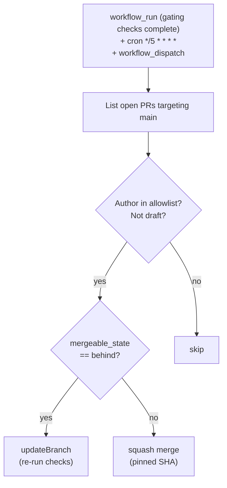

# Governance with rulesets

How GitHub branch-protection rulesets and CI workflows manage the kbx dataset
repos as code: required status checks, auto-merge automation, the conflation
carve-out, and the `refs`-not-`closes` discipline.

For the human-approval flow that sits on top of these gates, see
[human approval workflow](human-approval-workflow.md).

## Required status checks

Each kbx repo runs a set of CI workflows on every PR. The exact set varies by
repo, but the shared pattern is:

| Check | What it does | Repos |
|-------|-------------|-------|
| `test` | Run the test suite (`npm test`, `vitest`) | kbexplorer-cli, kbexplorer-core, kbexplorer-search, kbexplorer-template |
| `typecheck` | `tsc --noEmit` | kbexplorer-core, kbexplorer-search |
| `lint` | eslint | kbexplorer-search |
| `build` | Production build (`tsc -b`, `tsup`, Vite) | kbexplorer-core, kbexplorer-search |
| `dependency-review` | `actions/dependency-review-action@v4` (new dependency audit) | all repos with the workflow |
| `pr-title` | Reject empty, WIP, draft, or "do not merge" titles | all repos with the workflow |
| `check-linked-issue` | Require an issue reference in the PR title or body | all repos with the workflow |

### Surveyed workflows by repo

**kbexplorer** (this repo — docs only):
`dependency-review`, `linked-issue`, `pr-title`, `showcase-build-check`,
`showcase` (deploy, not a required check).

**kbexplorer-cli**:
`test` (npm test), `dependency-review`, `linked-issue`, `pr-title`.

**kbexplorer-core**:
`ci` (typecheck + build + test + pack check), `dependency-review`,
`linked-issue`, `pr-title`.

**kbexplorer-search**:
`CI` (lint + typecheck + test + build + pack check), `auto-merge`.

**kbexplorer-template**:
`dependency-review`, `linked-issue`, `pr-title`, `visual-regression`,
`full-loop`, `dtu-gitea`, `cross-real-repo`.

### The linked-issue check

The `check-linked-issue` workflow enforces the
[issue-first workflow](../AGENTS.md#issue-first-workflow): every PR must
reference a GitHub issue (`#N`, `refs #N`, `Closes #N`, or a full issue URL)
in its title or body. Bot authors (`dependabot[bot]`, `renovate[bot]`,
`github-actions[bot]`) are exempted, as is any PR with the
`no-linked-issue-required` label.

### Branch protection: check, don't assume

A live audit
([kbexplorer#105](https://github.com/anokye-labs/kbexplorer/issues/105))
found that some repos have **no branch-protection ruleset on `main` at all**,
despite documentation claiming they do. The `auto-merge.yml` workflow's
comment — "GitHub enforces every branch-protection rule server-side" — only
holds where a ruleset actually exists.

The AGENTS.md in each repo documents this reality and instructs contributors
to verify live settings via the API (`gh api repos/<owner>/<repo>/rules/branches/main`)
rather than trusting what documentation says.

Regardless of what the live ruleset does or doesn't enforce, two rules are
non-negotiable:

- **Never commit directly to `main`.**
- **Never force push.**

## Auto-merge automation

Every kbx repo has an `auto-merge.yml` workflow that squash-merges
**agent-authored** PRs at **0 human approvals** once they satisfy all required
status checks and conversation resolution.

### How it works



### Allowlisted bot accounts

The allowlist is identical across repos:

```js
const AGENT_AUTHORS = new Set([
  'devin-ai-integration[bot]',
  'copilot-swe-agent[bot]',
  'Copilot',
]);
```

Human-authored PRs are **never** auto-merged. If an agent's account isn't on
this allowlist, auto-merge does not apply.

### Triggers

- **`workflow_run`** — fires as soon as a gating check workflow finishes. The
  specific workflows vary by repo (e.g., `dependency-review`, `linked-issue`,
  `pr-title`, `test`).
- **`schedule: cron '*/5 * * * *'`** — backstop sweep for races, late thread
  resolution, and manual updates.
- **`workflow_dispatch`** — manual trigger.

### Safety mechanisms

- The merge is attempted via the REST API, so GitHub enforces every
  branch-protection rule server-side. A PR that is red, has unresolved
  threads, or is otherwise blocked returns 405 and is skipped.
- The merge pins to the listed head SHA: if a commit lands between listing and
  merge, GitHub returns 409, and the workflow retries against the new head on
  the next sweep.
- If a PR is `behind` main (strict checks require an up-to-date branch), the
  workflow calls `updateBranch` (using the freshly-fetched head SHA, not the
  stale list-time SHA) and skips it until the next sweep.
- After merge, the head branch is deleted (best-effort, same-repo only).

### The conflation exception

Even if a bot authored a conflation/entity-merge PR, it must **not** be
auto-merged — it requires human approval. See
[human approval workflow -> the conflation carve-out](human-approval-workflow.md#the-conflation-carve-out)
for the full rule and its rationale.

## `refs` not `closes`

Every repo enforces the convention: commit messages use `refs #N`, never
`closes #N` / `fixes #N`. Closure is a deliberate, separate step:

1. The PR merges.
2. The contributor re-verifies the referenced issue's acceptance criteria
   against the **current** repo state (re-read the file, re-run the check,
   re-fetch the live resource).
3. The issue is closed **citing specific evidence** that satisfied each
   criterion.

A PR's own description may use `Closes #N` once the PR is genuinely ready to
merge and review confirms the issue is fully addressed — that is a deliberate,
reviewed decision.

## The hygiene/launch-cut pattern

[kbexplorer#106](https://github.com/anokye-labs/kbexplorer/issues/106) tracks
the hygiene and launch-cut pattern: systematically closing the gap between
documented and actual CI gates, ensuring every repo has the checks it claims,
and that the checks actually fail when they should.

The post-mortem
([kbexplorer#102](https://github.com/anokye-labs/kbexplorer/issues/102)) that
motivated this governance work found:

- The access-label exclusion leak in search (now fixed — see
  [search corpus updates](search-corpus-updates.md)).
- CI gates that were documented but not configured.
- Agent PRs that claimed "all tests pass" with no CI to verify it.
- The consent-seam caveats documented in
  [human-in-the-loop ingestion](human-in-the-loop-ingestion.md).

These findings drove the explicit governance stance: check, don't assume;
verify before close; never trust a self-reported claim without automated
evidence.

## Cross-references

- [kbexplorer#105](https://github.com/anokye-labs/kbexplorer/issues/105) —
  the ruleset audit that found missing branch protection.
- [kbexplorer#106](https://github.com/anokye-labs/kbexplorer/issues/106) —
  the hygiene/launch-cut pattern.
- [kbexplorer#102](https://github.com/anokye-labs/kbexplorer/issues/102) —
  the post-mortem that motivates governance.
- Recent fix-wave PRs that ship the current behavior:
  [core PR#54](https://github.com/anokye-labs/kbexplorer-core/pull/54),
  [search PR#19](https://github.com/anokye-labs/kbexplorer-search/pull/19),
  [cli PR#211](https://github.com/anokye-labs/kbexplorer-cli/pull/211),
  [template PR#452](https://github.com/anokye-labs/kbexplorer-template/pull/452),
  [template PR#460](https://github.com/anokye-labs/kbexplorer-template/pull/460).

---

> This governance layer is not part of the four-layer architecture
> ([architecture.md](../architecture.md)) — it sits alongside it as the
> operational discipline that keeps the system healthy. The architecture
> concerns _what_ the system builds; governance concerns _how_ changes get
> reviewed, verified, and merged.
