# Hosting a dataset

Deploying a built kbx knowledge base so others can use it. Three deployment
patterns exist today: GitHub Pages (the showcase pattern), any static host,
and a localhost search service. The crux: **GitHub-the-host is separable from
git-the-store** — the dataset lives in git; Pages is the convenient default
for serving its representations, not a dependency.



For _creating_ the dataset in the first place, see
[creating a dataset](creating-a-dataset.md).

## What `kbx build` produces

```bash
kbx build    # -> dist/kb/
```

`kbx build` runs the template's Vite production build in local mode
(`VITE_KB_LOCAL=true`). The output is a self-contained static bundle in
`dist/kb/` with a baked-in manifest — no runtime GitHub token or API calls
needed. The manifest is generated from local `content/`, the file tree, the
README, and best-effort `gh` issues/PRs/commits.

## Pattern 1 — GitHub Pages (the showcase)

This repo itself is the reference example: the
[live showcase](https://anokye-labs.github.io/kbexplorer/) deploys the
`kbexplorer-template` SPA to GitHub Pages from this docs repo.

### How it works

The
[`showcase.yml`](https://github.com/anokye-labs/kbexplorer/blob/main/.github/workflows/showcase.yml)
workflow:

1. Checks out the template at a **pinned release tag** (currently `v0.4.0`,
   set via the `TEMPLATE_REF` env var in the workflow).
2. Checks out this (host) repo as the content source.
3. Runs `node scripts/generate-manifest.js` with `VITE_KB_LOCAL=true` and
   `VITE_KB_HOST_ROOT` pointing at the host checkout — baking config,
   authored content, file tree, README, and (best-effort) issues/PRs into
   `src/generated/repo-manifest.json`.
4. Runs `npx vite build` with `VITE_BASE_PATH=/kbexplorer/`.
5. Copies `index.html` to `404.html` for SPA routing.
6. Uploads and deploys via `actions/upload-pages-artifact` +
   `actions/deploy-pages`.

### Triggers

- `push` to `main` (but note: agent auto-merges via `GITHUB_TOKEN` do not emit
  a `push` event — those deploys come from the backstops below).
- `workflow_dispatch` (manual).
- `schedule: cron '17 4 * * *'` — daily rebuild keeps baked repo-aware content
  (issues/PRs) reasonably fresh.

### Not a required status check

`showcase.yml` never gates PRs or auto-merge. It deploys _after_ merge, on
demand, or on the daily schedule.

### Adopting this pattern for your own repo

1. Copy `showcase.yml` into your repo's `.github/workflows/`.
2. Set `TEMPLATE_REPO` and `TEMPLATE_REF` to the template and version you want.
3. Ensure your repo has authored content in `content/` or is repo-aware.
4. Enable GitHub Pages (Settings -> Pages -> Source: GitHub Actions).

The template advises host repos to **pin to a release tag**, not `main`. Bump
the tag via a normal issue-first PR when a new template release ships.

## Pattern 2 — any static host

The build output is a self-contained static bundle, so any environment that
can serve static files can host a kbx dataset. The key is `dist/kb/` (or the
template's `dist/`) — serve those files and set `VITE_BASE_PATH` to match the
URL the site is served under. Azure Static Web Apps or App Service, Vercel,
Netlify, Cloudflare Pages, and a plain `nginx` or `caddy` config all work.

Because the bundle bakes in its manifest at build time, the hosting
environment needs no GitHub token, no API access, and no server-side runtime —
the same properties that make the Pages pattern work make every other static
host work identically.

## Pattern 3 — Search service

The built explorer is static (self-contained local mode, no backend), so it
does not run search by default. To add semantic search:

```bash
# 1. Build the search index
kbx search-index                    # -> .search/ artifacts

# 2. Start the search service
kbx search-serve                    # localhost HTTP service
# or:
npx @anokye-labs/kbexplorer-search serve --dir .search --port 7700

# 3. Point the template at the service
VITE_SEARCH_SERVICE_URL=http://127.0.0.1:7700 npm run dev   # in kbexplorer-template
```

The search service exposes a small HTTP contract:

| Method & path | Body | Response |
|---------------|------|----------|
| `GET /health` | -- | `{ status, unitCount, model }` |
| `GET /stats` | -- | `{ unitCount, model, dimensions, contentHash, version }` |
| `POST /search` | `{ query, limit?, cluster?, entityType?, minScore?, graphRanking? }` | `{ results: SearchResult[], suggestions: RelatedSuggestion[] }` |

For details on how the search corpus is built, see
[search corpus updates](updating-the-search-corpus.md).

## Environment variables

| Variable | Purpose | Required |
|----------|---------|----------|
| `VITE_KB_LOCAL` | `true` for self-contained local mode | Build time |
| `VITE_KB_HOST_ROOT` | Path to the host repo's root (for the showcase pattern) | Build time |
| `VITE_BASE_PATH` | URL base path (e.g. `/kbexplorer/`) | Build time |
| `GH_TOKEN` | GitHub token for manifest generation (issues/PRs) | Build time (best-effort) |
| `VITE_SEARCH_SERVICE_URL` | URL of the search service | Runtime (optional) |

## Next steps

- [Updating a dataset](updating-a-dataset.md) — the refresh loop after first
  deploy.
- [Governance with rulesets](rulesets-and-automation.md) — how CI and branch
  protection manage the dataset repo.

## Cross-references

- Demand map: [G1 — install & distribute](../user-stories.md#g--operate--30),
  [G5 — run surfaces with one lifecycle](../user-stories.md#g--operate--30),
  [D9 — content negotiation](../user-stories.md#d--make-sense-of-it--27),
  [F1/F2 — llm-context & JSON-LD export](../user-stories.md#f--kb-as-context--export--29).
- Journey: [J3 — no GitHub host](../journeys.md#j3--kenji-perforce-helix-core-no-github-host)
  is the strongest test of the host seam.
- Delivered by: [#16](https://github.com/anokye-labs/kbexplorer/issues/16)
  (decouple host),
  [kbexplorer-cli#131](https://github.com/anokye-labs/kbexplorer-cli/issues/131)
  (lifecycle),
  [kbexplorer-template#423](https://github.com/anokye-labs/kbexplorer-template/issues/423)
  (surfaces).

---

> The showcase is a `spa` representation target rendering the pure `KBGraph`;
> see [architecture.md](../architecture.md) for the four-layer model and the
> [surfaces](../surfaces.md) doc for how the SPA and the embeddable Copilot
> canvas are different representation targets over the same graph.
