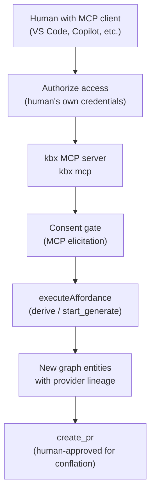

# Human-in-the-loop ingestion

MCP-based ingestion from systems of record that require a human's own
credentials: Teams, SharePoint, or similar sources where the human must be
present to authorize access (as opposed to a service account). This is
distinct from the AI-driven autonomous discovery in
[kbexplorer#113](https://github.com/anokye-labs/kbexplorer/issues/113) — that
is a background pass scanning channels with service-level access; this doc is
about a human actively using an MCP client with their own delegated
credentials to pull content in. The crux: **the person is the credential
boundary and the approval gate** — kbx never holds the credentials, and
ingestion never lands directly.


## Why this differs from autonomous ingestion

| Concern | Autonomous (kbexplorer#113) | Human-in-the-loop (this doc) |
|---------|---------------------------|------------------------------|
| **Credentials** | Service account / app registration | Human's own delegated credentials (OAuth, personal token) |
| **Presence** | Background; no human needed | Human actively authorizes and directs |
| **Consent** | Pre-authorized by config | Per-action, via the consent seam |
| **Discovery** | AI scans channels, proposes entities | Human selects what to ingest |

Both paths produce the same output: graph entities with provider lineage and
source attribution. Both paths require human approval for conflation (see
[human approval workflow](approving-a-change.md#the-conflation-carve-out)).

## The MCP adapter

The kbx MCP server
([`src/mcp/server.js`](https://github.com/anokye-labs/kbexplorer-cli/blob/main/src/mcp/server.js),
[`src/mcp/tools.js`](https://github.com/anokye-labs/kbexplorer-cli/blob/main/src/mcp/tools.js))
exposes the same affordances as the extension-tool and canvas adapters — the
same `executeAffordance` choke point, the same consent gate, the same
fail-closed behavior.

Start the MCP server:

```bash
kbx mcp            # start MCP server (consent-gated by default)
kbx mcp --allow    # non-interactive consent (explicit opt-in)
```

### Consent over MCP

The MCP consent bridge
([`src/mcp/consent.js`](https://github.com/anokye-labs/kbexplorer-cli/blob/main/src/mcp/consent.js))
renders the consent seam as an **MCP elicitation** (`elicitation/create`). The
transport-neutral `ConsentRequest` (title, action class, disclosure of model
cost / credential names / write targets) becomes an MCP elicitation prompt:

- Host `action: 'accept'` -> approved. Any collected credential values are
  threaded back via `decision.credentials`, which the registry merges into the
  affordance input.
- Host `action: 'decline' | 'cancel'` -> denied -> `CONSENT_DENIED`.
- **Fail-closed**: if the connected client does not advertise the
  `elicitation` capability, the seam denies with a clear message suggesting
  `--allow` for non-interactive consent.

A host that wants unattended writes opts in explicitly:
`kbx mcp --allow` or `KBX_MCP_CONSENT=allow` maps to
`seams.consentPolicy = 'allow'` and no elicitation seam is installed.

## The consent seam today

The
[kbexplorer#102](https://github.com/anokye-labs/kbexplorer/issues/102)
post-mortem (and specifically
[kbexplorer-cli#202](https://github.com/anokye-labs/kbexplorer-cli/issues/202)'s
AF-005/AF-006 findings) assessed which adapters have a working consent seam:

| Adapter | Consent status |
|---------|---------------|
| Extension-tool (primary) | Working — consent is enforced at the action core; the adapter inherits it. |
| MCP adapter | Working — MCP elicitation bridge is wired and fail-closed. |
| Canvas do-seam adapter | Working — routes through `executeAffordance`; same fail-closed gate. |

All three adapters route through `executeAffordance`
([`src/affordances/index.js`](https://github.com/anokye-labs/kbexplorer-cli/blob/main/src/affordances/index.js)),
which enforces consent once, at the action core. No adapter bypasses the gate.
Read-class actions (e.g., `search`, `query_node`, `graph_neighbors`) skip the
gate entirely with zero overhead.

## MCP server requirements

Fuzzy tasks (generation, derivation) may depend on external MCP servers
(e.g., `ado`, `sharepoint-docs`). Declare them in `.kbx.json`:

```jsonc
{
  "runtime": {
    "agent": "copilot",
    "mcp": {
      "required": ["ado", "sharepoint-docs"],
      "optional": ["org-chart"]
    }
  }
}
```

The CLI verifies required servers are configured **before** any LLM call or
partial write. On failure it prints the missing server name, the config file
it expected, and a one-line example entry, then exits non-zero. Optional
servers produce a warning only.

Detection locations per adapter:

| Adapter | Files checked |
|---------|---------------|
| `copilot` | `~/.copilot/mcp-config.json` |
| `claude` | `<repo>/.mcp.json` -> `~/.claude.json` |
| `custom` | Not possible — all servers reported as unverifiable |

`--skip-preflight` bypasses the check (development escape hatch, never CI).

## Provider lineage and source attribution

Content a human pulls in through this path records its provenance the same way
autonomous ingestion does. The provider-lineage requirement from
[kbexplorer#113](https://github.com/anokye-labs/kbexplorer/issues/113) applies:

- Each ingested entity carries a `source.ref` pointing to the originating
  resource in the system of record.
- The provider that produced the entity is recorded (the provider's `id` and
  the source's `sourceId` from
  [`kbx.sources[]`](https://github.com/anokye-labs/kbexplorer-cli/blob/main/README.md#multi-source-ingestion-kbxsources)).
- The derivation metadata (via
  [`stampProvenance`](https://github.com/anokye-labs/kbexplorer-cli/blob/main/src/affordances/provenance.js))
  records the generator, the extraction intermediate, and the source hash.

This is the same contract used by `derive` — the lineage mechanism is
shared, not reinvented for MCP-sourced content.

## The ingestion flow



1. The human starts an MCP client connected to `kbx mcp`.
2. They authenticate to the target system (Teams, SharePoint, etc.) using
   their own credentials — kbx never stores or manages these credentials.
3. They invoke a write/sample affordance (e.g., `derive` a document from
   SharePoint).
4. The consent gate fires: the MCP elicitation shows what will happen
   (credential names used, write targets), and the human approves or denies.
5. The affordance runs, producing entities with provider lineage.
6. The changes are proposed via `create_pr`. If any conflation is involved,
   the PR requires human approval (see
   [human approval workflow](approving-a-change.md#the-conflation-carve-out)).

## Cross-references

- [kbexplorer#113](https://github.com/anokye-labs/kbexplorer/issues/113) —
  AI discovery of PARA entities from channels (the autonomous counterpart).
  Provider lineage, search-before-write dedup, cross-source conflation.
- [kbexplorer#102](https://github.com/anokye-labs/kbexplorer/issues/102) —
  the post-mortem that found consent-seam caveats (AF-005/AF-006 in
  [kbexplorer-cli#202](https://github.com/anokye-labs/kbexplorer-cli/issues/202)).
- [kbexplorer#12](https://github.com/anokye-labs/kbexplorer/issues/12) —
  the forward-requirements vision. Human-in-the-loop ingestion is another
  source feeding the same graph; the "index, don't migrate" principle applies.
- [kbexplorer#114](https://github.com/anokye-labs/kbexplorer/issues/114) —
  deriving zettelkasten notes from ingested documents. Notes pulled in via
  this path follow the same re-check and human-edit policy.

---

> The MCP adapter is one of three delivery adapters over the same affordance
> registry — see
> [architecture.md -> do-seam](../architecture.md#the-do-seam--affordances-as-a-protocol-neutral-action-layer).
> The consent mechanism is enforced at the action core; the MCP adapter
> merely renders it as an MCP elicitation. The dependency arrow stays
> `affordances -> {adapters}`, never the reverse.
