# Human-in-the-loop ingestion via MCP

How knowledge that lives in **credentialed systems of record** — Teams,
SharePoint, Confluence, Drive — enters a kbx dataset. The crux: **the person
is the credential boundary and the approval gate**. kbx never holds the
credentials, and ingestion never lands directly; it is proposed, reviewed, and
merged like any other change.

## The flow

1. **Knowledge lives elsewhere** — the system of record is external and
   requires authentication that belongs to a *person*, not to the dataset:
   a Teams channel, a SharePoint site, a Confluence space.
2. **Connect an MCP server** — the user wires an MCP server for that system
   into their surface with **their own credentials** (bring-your-own `gh` and
   provider keys). kbx configuration points at the server; the secret stays
   with the user's tooling.
3. **Consent + cost disclosure** — before anything runs, the user is shown
   what will be read and what it will cost (calls, tokens, time). No silent
   crawls; scope is explicit and granted per operation.
4. **The provider ingests** — a generic provider maps MCP resources into
   nodes and edges. Source-native identity is preserved, access labels carry
   over from the source system, and provenance records what was observed
   from where, when.
5. **A change-set is staged** — the ingested subgraph is a proposal, exactly
   as in [approving a change](approving-a-change.md). Nothing lands in the
   dataset by virtue of having been readable.
6. **Review → PR → merge** — the user (or the routed authority) reviews the
   staged ingestion, the PR merges on green, and the
   [search corpus](updating-the-search-corpus.md) follows.

## Gates & guarantees

- **kbx never holds user credentials.** The MCP server runs with the user's
  identity; revoking access at the source revokes kbx's reach with it.
- **Access labels travel.** Content restricted in the source arrives labeled;
  the host enforces the boundary when the dataset is served.
- **Agents act only on advertised operations.** An agent can *propose*
  ingestion through the same seam, but the consent and review gates are
  human-only.
- **Re-ingestion is drift-aware.** Running the same connection again scopes
  to what changed at the source, feeding the ordinary
  [update workflow](updating-a-dataset.md).

## Traceability

- Stories: [G2 — wire MCP config + credentials](../user-stories.md#g--operate--30),
  [E4 — derive nodes from an arbitrary source](../user-stories.md#e--affordance-aware-actions-on-any-node--28),
  [E8 — agent acts only on advertised operations](../user-stories.md#e--affordance-aware-actions-on-any-node--28),
  [F3 — expose the KB as MCP tools](../user-stories.md#f--kb-as-context--export--29).
- Journeys: [J4 — the no-repo analyst](../journeys.md#j4--noor-the-no-repo-analyst)
  (import-only, no terminal), [J6 — compliance & governance](../journeys.md#j6--elena-compliance--governance)
  (consent + cost disclosure).
- Delivered by: [kbexplorer-cli#156](https://github.com/anokye-labs/kbexplorer-cli/issues/156)
  (MCP config + credentials), [kbexplorer-cli#135](https://github.com/anokye-labs/kbexplorer-cli/issues/135)
  (generic provider), [kbexplorer-cli#155](https://github.com/anokye-labs/kbexplorer-cli/issues/155)
  (consent), [#17](https://github.com/anokye-labs/kbexplorer/issues/17) (access labels).
