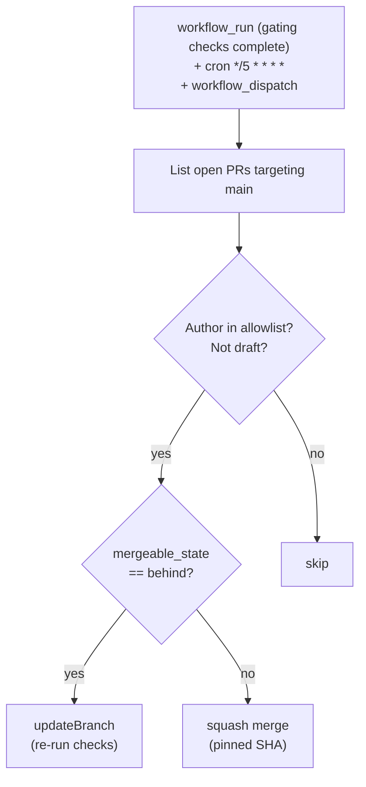

# Governance with rulesets

How GitHub branch-protection rulesets and CI workflows govern **a kbx dataset
repository**: which kbx commands make good required checks, how agent-authored
changes flow through zero-approval auto-merge lanes, and which changes must
never merge without a human. The crux: **the host enforces; kbx declares** —
kbx defines what a healthy dataset looks like (clean derive, matching corpus,
structural integrity), and the repo's ruleset makes those definitions binding
on every change.



The kbx org's own repositories run this same pattern and serve as the
reference implementation; where this page cites a workflow file, that is where
to copy it from. For the human-approval flow that sits on top of these gates,
see [human approval workflow](approving-a-change.md).

## The ruleset on `main`

A dataset repo's branch ruleset should block direct pushes and force pushes
and require status checks before merge. This is what makes "the delta is a
proposal" enforceable rather than aspirational — without it, every other gate
on this page is advisory.

Regardless of what the live ruleset does or doesn't enforce, two rules are
non-negotiable for every contributor, human or agent:

- **Never commit directly to `main`.**
- **Never force push.**

### Check, don't assume

A live audit
([kbexplorer#105](https://github.com/anokye-labs/kbexplorer/issues/105))
found repos with **no branch-protection ruleset on `main` at all**, despite
documentation claiming otherwise. Verify the live settings via the API rather
than trusting what any document (including this one) says:

```bash
gh api repos/<owner>/<repo>/rules/branches/main
```

If the live ruleset doesn't match what's documented, that's a finding to file,
not a gap to quietly use.

## Required checks for a dataset repo

kbx's deterministic gates are ordinary commands, so they slot directly into CI
— a maintainer can reproduce any red build locally with the same command the
bot ran:

| Check | Command | What it gates |
|-------|---------|---------------|
| Structural integrity | `kbx audit` | Duplicate ids, broken parents, cycles, dead connections |
| Derivation drift | `kbx derive <sources> --check` | Committed artifacts match a fresh deterministic emit (no LLM calls) |
| Search-corpus drift | `kbx search-index --check` | Committed index matches the current graph (no embedding calls) |
| Linked issue | `check-linked-issue` workflow | Every PR references an issue (`refs #N` or URL) in title or body |
| PR title | `pr-title` workflow | Rejects empty, WIP, draft, or "do not merge" titles |
| Dependency review | `actions/dependency-review-action` | Audits newly introduced dependencies |

The linked-issue check enforces the
[issue-first workflow](../../AGENTS.md#issue-first-workflow): every change
traces to a GitHub issue. Bot authors (`dependabot[bot]`, `renovate[bot]`,
`github-actions[bot]`) are exempted, as is any PR with the
`no-linked-issue-required` label.

Deploy workflows (like the showcase's `showcase.yml`) are deliberately **not**
required checks — they run after merge, on demand, or on a schedule. See
[hosting a dataset](hosting-a-dataset.md).

## Auto-merge for agent-authored changes

Datasets maintained with agents accumulate many routine PRs (refreshed
derivations, reindexed corpora, incidental node updates). The
[`auto-merge.yml`](https://github.com/anokye-labs/kbexplorer/blob/main/.github/workflows/auto-merge.yml)
pattern squash-merges **agent-authored** PRs at **0 human approvals** once all
required checks pass and conversations are resolved.



### Scope it deliberately

- **Allowlist the agent accounts explicitly** — e.g.
  `devin-ai-integration[bot]`, `copilot-swe-agent[bot]`, `Copilot`.
  Human-authored PRs are **never** auto-merged; a human asked for review by
  opening a PR.
- **The merge is attempted via the REST API**, so GitHub enforces every
  branch-protection rule server-side — a red, blocked, or
  unresolved-conversation PR returns 405 and is skipped. This safety only
  holds where a ruleset actually exists (see *check, don't assume* above).
- **The merge pins to a head SHA**: if a commit lands in between, GitHub
  returns 409 and the workflow retries against the new head on the next
  sweep. A `behind` PR gets `updateBranch` (re-running checks) and is picked
  up next sweep.

### The conflation exception

**Any conflation or entity-merge change is ALWAYS a human-approved PR** —
even when a bot authored it. A same-as claim asserts two system-of-record
entities are one real-world thing; getting it wrong corrupts the graph
silently, so it is carved out of the auto-merge lane entirely. See
[human approval workflow → the conflation carve-out](approving-a-change.md#the-conflation-carve-out).

## `refs`, not `closes`

Commit messages use `refs #N`, never `closes #N` / `fixes #N` — an early
commit's auto-close would close an issue before the branch and its review are
done. Closure is a deliberate, separate step:

1. The PR merges.
2. The contributor re-verifies the issue's acceptance criteria against the
   **current** repo state (re-read the file, re-run the check, re-fetch the
   live resource).
3. The issue is closed **citing specific evidence** for each criterion.

## Keeping the gates honest

The post-mortem
([kbexplorer#102](https://github.com/anokye-labs/kbexplorer/issues/102))
behind this governance stance found CI gates that were documented but not
configured, and agent PRs that claimed "all tests pass" with no CI to verify
it. [kbexplorer#106](https://github.com/anokye-labs/kbexplorer/issues/106)
tracks the resulting hygiene pattern: periodically close the gap between the
checks a repo claims and the checks it actually runs — and confirm they fail
when they should. The stance in one line: *check, don't assume; verify before
close; never trust a self-reported claim without automated evidence.*

## Cross-references

- [kbexplorer#105](https://github.com/anokye-labs/kbexplorer/issues/105) —
  the ruleset audit that found missing branch protection.
- [kbexplorer#106](https://github.com/anokye-labs/kbexplorer/issues/106) —
  the hygiene/launch-cut pattern.
- [kbexplorer#102](https://github.com/anokye-labs/kbexplorer/issues/102) —
  the post-mortem that motivates governance.
- Demand map: [C3 — CI gates drift](../user-stories.md#c--keep-healthy--current--26),
  [G3 — doctor / preflight](../user-stories.md#g--operate--30),
  [G4 — build + commit index](../user-stories.md#g--operate--30).

---

> This governance layer is not part of the four-layer architecture
> ([architecture.md](../architecture.md)) — it sits alongside it as the
> operational discipline that keeps a dataset healthy. The architecture
> concerns _what_ the system builds; governance concerns _how_ changes get
> reviewed, verified, and merged.
