# Updating a kbx dataset

How a dataset stays current without anyone re-authoring the graph. The crux:
**updates are incremental and reviewable**. A change — whether an author's
edit, a contributor's code change, or drift detected in an upstream source —
is scoped to the subgraph it affects, regenerated narrowly, and lands through
a pull request like any other change to the repository.

## The flow

1. **A change happens** — an author edits content, a contributor's PR touches
   code the KB describes, or the drift loop notices an upstream source no
   longer matches what was ingested.
2. **Scope what changed** — "affected" is computed from the change itself
   (diff-scoped for git; a changelist/shelf/label range for non-git stores):
   which nodes and edges does this touch?
3. **Regenerate narrowly** — only the affected subgraph is refreshed. Cheap
   refresh is the design goal; a full rebuild is the fallback, not the norm.
4. **Stage a branch + PR** — the regenerated delta is committed to a branch
   and opened as a pull request. Never a direct commit to `main`; the delta
   *is* the proposal.
5. **Review the delta** — the reviewer sees a rendered diff plus freshness
   and staleness signals, not a wall of regenerated files.
6. **Merge on green** — CI gates drift (see
   [rulesets & automation](rulesets-and-automation.md)); on merge, surfaces
   and the [search corpus](updating-the-search-corpus.md) refresh.

## Gates & guarantees

- **The KB never silently rots.** Staleness is a first-class, visible signal
  (per-node freshness), not an archaeology exercise.
- **Incidental contribution works.** A code change can spawn or update a node
  without the contributor ever "authoring the graph."
- **Derivation is honest.** When an upstream fact changes, dependents derived
  from it (`wasDerivedFrom`) are flagged stale rather than silently kept or
  silently deleted.

## Traceability

- Stories: [B2 — incidental node from a code change](../user-stories.md#b--grow--curate--25),
  [C1 — incremental refresh](../user-stories.md#c--keep-healthy--current--26),
  [C2 — freshness & staleness signals](../user-stories.md#c--keep-healthy--current--26),
  [H1 — drift loop](../user-stories.md#h--sync--trust--31),
  [K4 — honest derivation](../user-stories.md#k--time--provenance-semantic-space-time--32).
- Delivered by: [kbexplorer-cli#136](https://github.com/anokye-labs/kbexplorer-cli/issues/136)
  (affected dispatch), [kbexplorer-cli#158](https://github.com/anokye-labs/kbexplorer-cli/issues/158)
  (refresh), [kbexplorer-cli#157](https://github.com/anokye-labs/kbexplorer-cli/issues/157)
  (freshness), [kbexplorer-core#24](https://github.com/anokye-labs/kbexplorer-core/issues/24)
  (derivation).
