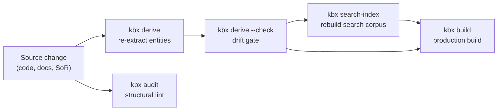

# Updating a dataset

The refresh loop: re-deriving content, checking for drift, triggering rebuilds,
and keeping the search corpus current. This is the day-to-day operational
process for a running kbx knowledge base.

For initial setup, see [creating a dataset](creating-a-dataset.md). For the
search-specific deep dive, see [search corpus updates](search-corpus-updates.md).

## The refresh loop



## 1. Identify what changed

After a code or documentation change:

```bash
npx kbx affected HEAD~1         # which content nodes cite changed files?
npx kbx affected HEAD~1 --json  # machine-readable for tooling
```

`affected` maps a git diff to impacted content nodes via their citations,
telling you exactly which pages need refreshing.

## 2. Re-derive entities

If `.docx`, prose `.md`, or `.txt` sources under a derived path changed,
refresh their artifacts:

```bash
npx kbx derive path/to/source.md --refresh   # force re-extraction even if fresh
npx kbx derive docs/*.docx                    # re-derive; unchanged sources skip the LLM
```

**Idempotency**: artifacts are timestamp-free and serialized with sorted keys.
Identical input produces byte-identical output. The artifact embeds the
extraction intermediate keyed by the source's SHA-256; re-running on unchanged
sources reuses that intermediate and re-emits deterministically **without
calling the LLM**.

## 3. Run the drift gate

```bash
npx kbx derive docs/*.docx --check   # CI drift gate, no API calls
```

`--check` is a read-only gate: it reports drift (and exits non-zero) when an
artifact is missing, its source has changed, or a fresh deterministic emit
differs from the committed bytes. It never invokes Copilot. Suitable for CI.

## 4. Validate structurally

```bash
npx kbx audit    # hard structural lint (CI-grade, exits non-zero on errors)
npx kbx links    # soft graph-health report (advisory)
```

`audit` checks: duplicate ids, broken parents, parent cycles, dead
connections, missing required frontmatter, undeclared clusters. `links`
reports: orphans, weak clusters, coverage gaps.

## 5. Update the search corpus

```bash
npx kbx search-index             # extract + embed + write to .search/
npx kbx search-index --check     # CI drift gate (no API calls)
```

The search index is rebuilt from the same knowledge graph. The drift gate
compares committed artifacts (`units.json`, `vectors.json`, `index-meta.json`)
against a fresh extraction — purely deterministic, no embedding API calls.

See [search corpus updates](search-corpus-updates.md) for the full deep dive
on how `SearchUnit`s are derived, access labels are enforced, and the lexical
(BM25) provider works without credentials.

### Future: PARA classification and document-to-note derivation

The reindex loop is where two planned features will run alongside the
graph/search refresh:

- **PARA classification pass**
  ([kbexplorer#112](https://github.com/anokye-labs/kbexplorer/issues/112)) —
  kbx auto-classifies graph entities as Projects, Areas, Resources, or Archive
  and proposes + executes archiving decisions. Not yet built.
- **Document-to-note derivation pass**
  ([kbexplorer#114](https://github.com/anokye-labs/kbexplorer/issues/114)) —
  derives zettelkasten-style notes from long-form documents, maintaining the
  note-to-source link. Notes are re-checked every reindex, with a
  human-edit-vs-regenerate policy preserving manual refinements. Not yet built.

Both are epics, not shipped features. They are scoped to run during the
reindex loop because that is where the full graph and search corpus are
available for classification and derivation.

## 6. Rebuild and deploy

```bash
npx kbx build    # production build -> dist/kb/
```

See [hosting a dataset](hosting-a-dataset.md) for deployment options.

## Incremental vs. full refresh

| Trigger | What to re-run | Why |
|---------|----------------|-----|
| Content source changed | `kbx derive <source> --refresh` for that source, then `audit` + `search-index` | Only the changed source needs re-extraction |
| Code change in the repo | `kbx affected <ref>` to find impacted nodes, refresh those | Surgical update based on citation graph |
| New template version | `kbx update`, then `kbx build` | Template change does not affect content |
| Full periodic refresh | `kbx derive`, `kbx search-index`, `kbx build` | Catch any accumulated drift |

## CI-driven refresh

### Scheduled (cron)

A GitHub Actions workflow on a cron schedule (ties to
[user-stories.md G4 / #159](../user-stories.md) — scheduled-and-webhook-refresh)
can run the deterministic gates and rebuild:

```yaml
on:
  schedule:
    - cron: '0 4 * * *'   # daily at 4am UTC
jobs:
  refresh:
    steps:
      - uses: actions/checkout@v7
      - uses: actions/setup-node@v4
        with: { node-version: 22 }
      - run: npm ci
      - run: npx kbx derive content/derived-sources/*.md --check
      - run: npx kbx audit
      - run: npx kbx search-index --check
      - run: npx kbx build
```

### Webhook-triggered

A `repository_dispatch` or `workflow_dispatch` event can trigger the same
refresh on demand — useful when an upstream system of record (an issue tracker,
a CMS) pushes a change notification.

## The recommended loop (manual)

From the
[`kbexplorer-cli` AGENTS.md](https://github.com/anokye-labs/kbexplorer-cli/blob/main/AGENTS.md):

```bash
# 1. Find which content nodes cite the changed files
npx kbx affected HEAD~1

# 2. Refresh those pages (follow writer-playbook.md or update-node.md)

# 3. If a derived source changed, refresh its artifact
npx kbx derive path/to/source.md --refresh

# 4. Validate
npx kbx audit
npx kbx links
npx kbx derive content/derived-sources/*.md --check

# 5. Confirm it renders
npx kbx dev
```

## Cross-references

- The drift-gate pattern (committed artifacts + SHA-256 keying + `--check`)
  is the same pattern used for cross-source connection artifacts
  ([history.md](../history.md)).
- The forward-requirements vision
  ([kbexplorer#12](https://github.com/anokye-labs/kbexplorer/issues/12)) —
  identity, addressing, composition, representation, semantic space-time — is
  the "index, don't migrate" principle these workflows embody.
- For how changes get human sign-off, see
  [human approval workflow](human-approval-workflow.md).

---

> The architecture is four layers: Sources -> Providers -> Engine ->
> Representation ([architecture.md](../architecture.md)). The refresh loop
> re-runs the left side (sources, providers) and deterministically regenerates
> the right side (engine output, representation artifacts). The graph is always
> re-derived, never mutated in place.
