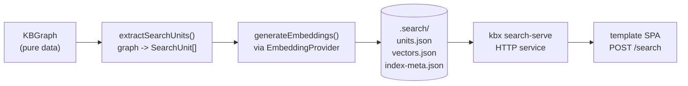

# Search corpus updates

Deep-dive companion to [updating a dataset](updating-a-dataset.md): how
`kbexplorer-search` derives `SearchUnit`s from the graph, the embedding and
lexical providers, the deterministic drift gate, access-label exclusion at
index time, and how a host serves it. The crux: **the corpus is versioned with
the graph and gated by CI** — search results are only ever as fresh as the
last green build, and that is a checkable property, not a hope.



For the broader refresh loop, see [updating a dataset](updating-a-dataset.md).
For the architecture, see
[architecture.md -> search](../architecture.md#search--a-first-class-representation-over-the-graph).

## The search pipeline



## SearchUnit extraction

[`extractSearchUnits(graph)`](https://github.com/anokye-labs/kbexplorer-search/blob/main/src/extract.ts)
converts a `KBGraph` into an array of `SearchUnit`s — the atomic searchable
entities. Each unit carries graph-aware metadata so embeddings capture
structure, not just prose:

- **Context header** prepended to the text: `Title | Cluster | Path
  (hierarchy) | Related (neighbor titles)`.
- **Connections**: 1-hop neighbor IDs from the edge list.
- **Hierarchy path**: ancestor titles from parent traversal.
- **Neighbor titles**: top-8 neighbors ranked by edge weight, sorted
  alphabetically for determinism.
- **Identity**: `kg://` URN, entity type, cluster.

Long nodes are chunked at heading boundaries (`##` / `###`), with overlap from
the previous chunk's tail. Each chunk gets its own `SearchUnit` with a
`unitId` of `<nodeId>#<chunkIndex>`.

Output is deterministic: sorted by `unitId`, no timestamps, no randomness.

## Embedding providers

| Provider | Credentials | Index artifacts | Query scoring |
|----------|-------------|------------------|----------------|
| `openai` (default) | `OPENAI_API_KEY` | `units.json` + `vectors.json` + `index-meta.json` | Cosine similarity |
| `lexical` | none | `units.json` + `vectors.json` (empty) + `index-meta.json` (`providerType: "lexical"`) + `lexical-index.json` | Okapi BM25 |

### The lexical (BM25) provider

The `lexical` provider
([`src/providers/lexical.ts`](https://github.com/anokye-labs/kbexplorer-search/blob/main/src/providers/lexical.ts))
is a deterministic, zero-credential BM25 term index. It backs the `kbx`
onboarding "local" search mode where no API key is available.

```ts
import { extractSearchUnits, computeContentHash, buildLexicalIndex,
         createLexicalSearchEngine, writeLexicalArtifacts } from '@anokye-labs/kbexplorer-search';

const units = extractSearchUnits(graph);
const index = buildLexicalIndex(units);          // deterministic BM25 term index
const contentHash = computeContentHash(graph);   // SHA-256 of canonical graph
writeLexicalArtifacts('.search', units, index, contentHash);

const engine = createLexicalSearchEngine(units, index);
const results = await engine.search('how does audit validation work?');
```

`LexicalProvider` is registered in the provider registry
(`getProvider('lexical', ...)` / `listProviders()`) for discovery. Its
`embed()` intentionally throws, since BM25 needs corpus-wide statistics that a
stateless per-call embedding cannot carry — the real query path is
`createLexicalSearchEngine`.

`lexical-index.json` is additive to the standard artifact set, so
`readArtifacts` / `checkDrift` work unchanged against a lexical index
directory.

### Optional FAISS acceleration

`createFaissEngine` builds a FAISS `IndexFlatIP` from checked-in vectors for
faster k-NN on large indexes. FAISS is **runtime acceleration only** — the
portable JSON artifacts remain the durable source of truth. `faiss-node` is an
optional dependency; when it's unavailable, the engine transparently falls back
to the pure-JS cosine engine (`search-engine.ts`).

## The deterministic drift gate

```bash
kbx search-index --check    # CI gate, no API calls
```

[`checkDrift(artifactDir, graph)`](https://github.com/anokye-labs/kbexplorer-search/blob/main/src/drift.ts)
re-extracts `SearchUnit`s from the current graph (no embedding call) and
compares against committed `units.json` + `index-meta.json`:

- **Content hash match**: SHA-256 of the canonical graph vs.
  `index-meta.json.contentHash`.
- **Missing units**: in the current graph but absent from artifacts.
- **Extra units**: in artifacts but absent from the current graph.
- **Stale units**: present in both but with different text (canonical JSON
  comparison).

The gate exits 0 when `fresh === true` (all four checks pass), non-zero
otherwise. It never calls an embedding API.

## Access-label exclusion

The index-build path respects access labels carried on nodes
(`KBAccessLabel { classification, visibility, labels[] }`). This is the
**current, fixed** behavior after a real access leak was discovered and
hardened
([kbexplorer#102](https://github.com/anokye-labs/kbexplorer/issues/102)):

### Default mode: `exclude` (SAFE)

Nodes whose `classification` is `confidential`, `restricted`, or `unknown`, or
whose `visibility` is `private`, produce **no `SearchUnit` and no vector**.
They never reach `units.json` / `vectors.json`, so even titles cannot leak via
search.

The critical fix (AF-001 /
[search#15](https://github.com/anokye-labs/kbexplorer-search/issues/15) /
[search#16](https://github.com/anokye-labs/kbexplorer-search/issues/16)):
**exclusion happens before adjacency derivation**. The node map and edge list
used by `buildConnectionMap`, `getNeighborTitles`, `buildHierarchyPath`, and
the raw `parentId` pass-through are filtered _up front_ to remove excluded
nodes. An excluded node's title/id is unreachable from any surviving unit —
including indirectly, through a neighboring public unit's embedded text,
`connections[]`, `parentId`, or `metadata.{neighborTitles, hierarchyPath}`.

### Fail-closed on unrecognized labels

`KBAccessClassification` and `KBAccessVisibility` are **open unions**. Any
bespoke token a host mints (e.g. `top-secret`, `need-to-know`) cannot be
ranked against the built-in lattice — it is withheld by default rather than
silently indexed
([kbexplorer#102](https://github.com/anokye-labs/kbexplorer/issues/102)). Only
genuinely absent labels fail open (treated as public/unlabeled).

The classification severity lattice
([`src/access.ts`](https://github.com/anokye-labs/kbexplorer-search/blob/main/src/access.ts)):

```
unknown > restricted > confidential > internal > public > absent
```

### Opt-in mode: `include` (host-predicate filtered)

Restricted units are indexed _with their `access` label attached_ so a host
can filter at query time via `SearchOptions.filterUnit`:

```ts
const results = await engine.search(query, {
  filterUnit: (unit) => hasAccess(currentPrincipal, unit.access),
});
```

In `include` mode, _every_ labeled node (including `public`) carries its label
so the host has the full label set. Search still performs **no** principal
evaluation — kbx labels, the host enforces.

### Exclusion is pure

Exclusion is a pure function of `(label, config)` — no timestamps, no
randomness — so artifacts stay byte-identical and the `--check` drift gate
stays green.

## Serving the search corpus

```bash
# From a repo with .search/ artifacts:
npx @anokye-labs/kbexplorer-search serve --dir .search --port 7700
# or:
kbx search-serve
```

The service loads artifacts, builds an in-memory vector index (or FAISS index
if available), and serves:

| Endpoint | Body | Response |
|----------|------|----------|
| `GET /health` | -- | `{ status, unitCount, model }` |
| `GET /stats` | -- | `{ unitCount, model, dimensions, contentHash, version }` |
| `POST /search` | `{ query, limit?, cluster?, entityType?, minScore?, graphRanking? }` | `{ results, suggestions }` |

When `graphRanking: true`, results are re-ranked with graph structure and
`suggestions` (related graph neighbors not already in the result set) are
returned.

The
[kbexplorer-template](https://github.com/anokye-labs/kbexplorer-template) SPA
is the reference consumer: `POST /search` against
`VITE_SEARCH_SERVICE_URL`.

## Cross-references

- [kbexplorer#102](https://github.com/anokye-labs/kbexplorer/issues/102) —
  the post-mortem that found the access-exclusion leak.
- [search PR#19](https://github.com/anokye-labs/kbexplorer-search/pull/19) —
  the fix-wave PR that ships the access-exclusion fix and lexical search
  provider.
- [kbexplorer#12](https://github.com/anokye-labs/kbexplorer/issues/12) — the
  forward-requirements vision. Search is a representation over the graph, not
  a separate data store.

---

> **kbexplorer** defines and renders the knowledge graph;
> **kbexplorer-search** derives, validates, and serves semantic search over it.
> The contract and the exact `SearchUnit` / `SearchResult` types live in
> [`kbexplorer-search`](https://github.com/anokye-labs/kbexplorer-search);
> this document describes the operational workflow, not the type definitions —
> see the
> [kbexplorer-search README](https://github.com/anokye-labs/kbexplorer-search#readme)
> for the library API.
